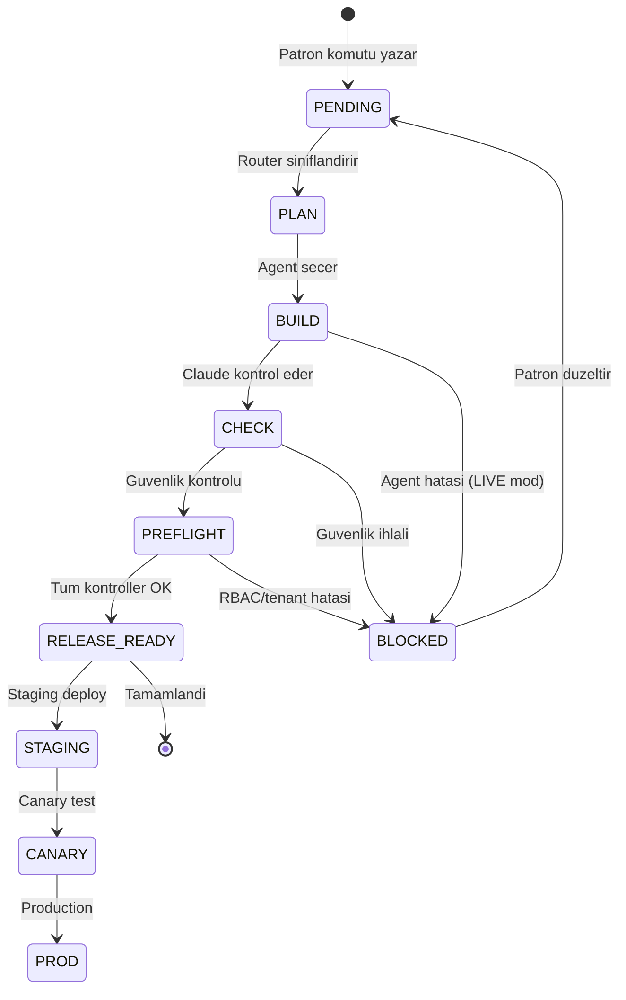

# YiSA-S GOREV KOMUT SISTEMI

**Tarih:** 24 Subat 2026 (Guncelleme: 24 Subat 2026 - Tutarlilik kontrolu)
**Sistem:** Patron Robot Orchestrator (PLAN → BUILD → CHECK → PREFLIGHT → RELEASE)
**Modlar:** LIVE (canli) | DEMO (simulasyon)
**Asamalar:** STAGING → CANARY → PROD

---

## 1. GENEL KURALLAR

### 1.1 Komut Akisi
1. **Patron** komutu yazar (chat veya komut merkezi)
2. **Router** komutu keyword'lere gore siniflandirir (TaskType + Agent secimi)
3. **Orchestrator** plani olusturur (PLAN asamasi)
4. **Agent** gorevi yurutur (BUILD asamasi)
5. **Checker** (Claude) ciktiyi guvenlik acisindan kontrol eder (CHECK asamasi)
6. **Preflight** RBAC, tenant izolasyonu ve kilit kontrolu yapar
7. **Release** sonucu STAGING/CANARY/PROD'a hazirlar

### 1.2 Guvenlik Sinirlamalari
- **Tenant izolasyonu:** Her komut tek bir tenant'a ait, capraz erisim ENGELLENIR
- **KVKK/PII:** Gercek kisi/telefon vb. kisisel veri UYDURULMAZ
- **Destructive islemler:** Silme/geri donusumsuz islemler LIVE modda BLOKLANIR
- **Rol/scope:** Komut sahibinin rol yetkileri disina TASILAMAZ
- **LIVE modda checker hatasi:** Agent veya checker calismiyorsa islem BLOKLANIR

### 1.3 Oncelik ve Onay
- **P0 (Acil):** Patron dogrudan onaylar, aninda calistirilir
- **P1-P2:** CEO gorev kuyrugundan gecebilir, onay bekleyebilir
- **P3-P4:** Planlamaya alinir, rutin gorev olarak zamanlanabilir
- Patron `patron_commands` tablosuna kaydedilir (status: pending → approved/rejected)
- Onaylanan gorevler `ceo_tasks` tablosuna aktarilir

### 1.4 AI Provider Fallback Sirasi
| Oncelik | Provider | Kullanim | Maliyet |
|---------|----------|---------|---------|
| 1 | GPT-4o | Varsayilan DEV/SUPPORT agent | Orta |
| 2 | Claude | Derin analiz, CHECK asamasi, icerik | Orta-Yuksek |
| 3 | Gemini | Gorsel analiz, DATA/DESIGN | Orta |
| 4 | Together (Llama 3.1) | Ekonomik, yuksek hacimli rutinler | Dusuk |
| Fallback | GPT-4o | Tum bilinmeyen komutlar | Orta |

---

## 2. ARAC KOMUT SABLONLARI

### 2.1 DEVIN (Kod Gelistirme + DevOps)

| Alan | Deger |
|------|-------|
| **Tur:** | Otonom AI yazilim muhendisi |
| **Entegrasyon:** | GitHub PR olusturma, kod degisikligi, CI/CD |
| **TaskType:** | DEV, DEVOPS, GIT |

**Standart Komut Sablonlari:**

```
# Yeni ozellik ekleme
"Devin: [REPO_ADI] reposunda [OZELLIK_ACIKLAMASI] ozelligini ekle. 
Branch: devin/[timestamp]-[slug]. PR olustur."

# Bug fix
"Devin: [REPO_ADI] reposundaki [HATA_ACIKLAMASI] hatasini duzelt. 
Mevcut testleri bozma. PR olustur."

# Refactoring
"Devin: [DOSYA_YOLU] dosyasini refactor et. 
[HEDEF_ACIKLAMA]. Mevcut davranisi degistirme."

# Dokumantasyon
"Devin: [REPO_ADI] reposuna [DOKUMAN_TURU] dokumantasyonu ekle."

# CI/CD
"Devin: [REPO_ADI] reposuna GitHub Actions CI pipeline ekle. 
Lint + build + test asamalari olsun."
```

**Kurallar:**
- Her zaman yeni branch olusturur, main'e dogrudan push YASAK
- PR olusturmadan once lint ve build kontrolu yapar
- Force push YASAK, amend YASAK
- `.env` dosyalari commit edilmez

---

### 2.2 V0 (UI Bileseni Uretimi)

| Alan | Deger |
|------|-------|
| **Tur:** | Vercel V0 - React/Next.js UI uretimi |
| **Entegrasyon:** | `lib/api/v0-client.ts`, `lib/patron-robot/agents/v0.ts` |
| **TaskType:** | DESIGN |
| **Durum:** | Placeholder (API entegrasyonu bekliyor) |

**Standart Komut Sablonlari:**

```
# Dashboard bileseni
"V0: Patron dashboard icin [WIDGET_TURU] widget'i olustur. 
Shadcn/UI + Radix kullan. Dark tema uyumlu olsun."

# Form bileseni
"V0: [FORM_ADI] formu olustur. Alanlar: [ALAN_LISTESI]. 
react-hook-form + zod validation kullan."

# Tablo bileseni
"V0: [VERI_TURU] icin siralama/filtreleme destekli tablo bileseni olustur."

# Grafik bileseni
"V0: [METRIK_ADI] icin recharts ile [GRAFIK_TURU] grafigi olustur."
```

**Kurallar:**
- Shadcn/UI + Radix UI bilesenleri tercih edilir
- Tailwind CSS kullanilir (inline style YASAK)
- Dark tema uyumu zorunlu
- Mevcut `components/ui/` yapisina uygun olacak

---

### 2.3 CURSOR (Kod Uretimi)

| Alan | Deger |
|------|-------|
| **Tur:** | AI destekli kod editoru |
| **Entegrasyon:** | `lib/api/cursor-client.ts`, `lib/patron-robot/agents/cursor.ts` |
| **TaskType:** | DEV |
| **Durum:** | Placeholder (API entegrasyonu bekliyor) |

**Standart Komut Sablonlari:**

```
# API endpoint olusturma
"Cursor: /api/[ENDPOINT_ADI] endpoint'i olustur. 
Method: [GET/POST/PATCH/DELETE]. Supabase [TABLO_ADI] tablosuna bagla."

# Component kodu
"Cursor: [BILESEN_ADI] React component'i yaz. 
Props: [PROP_LISTESI]. TypeScript strict mod."

# Utility fonksiyonu
"Cursor: lib/ altinda [FONKSIYON_ADI] utility fonksiyonu yaz. 
Girdi: [TIP], Cikti: [TIP]. Test edilebilir olsun."

# Bug fix
"Cursor: [DOSYA_YOLU] dosyasindaki [HATA] sorununu coz. 
Mevcut davranisi koru, sadece belirtilen sorunu duzelt."
```

**Kurallar:**
- TypeScript strict mode zorunlu
- Mevcut import/export konvansiyonlarina uyulmali
- `Any` tipi YASAK
- Fonksiyonlar JSDoc ile dokumante edilmeli

---

### 2.4 FAL AI (Gorsel / Video Uretimi)

| Alan | Deger |
|------|-------|
| **Tur:** | AI gorsel ve video uretimi (Flux/Schnell, Veo 3.1) |
| **Entegrasyon:** | `lib/api/fal-client.ts` |
| **API:** | `https://fal.run/fal-ai/veo3.1` |
| **Env:** | `FAL_KEY` veya `FAL_API_KEY` |

**Standart Komut Sablonlari:**

```
# Tanitim videosu
"Fal: YiSA-S fuar tanitim videosu olustur. 
Slogan: [SLOGAN_INDEKSI]. 8 saniye, 16:9, 720p. Sesli."

# Logo animasyonu
"Fal: YiSA-S logo animasyonu olustur. 
Donen logo, modern, canli renkler, cocuk dostu."

# Sosyal medya gorseli
"Fal: [PLATFORM] icin [BOYUT] boyutunda tanitim gorseli olustur. 
Tema: [TEMA]. Metin: [METIN]."

# Spor gorseli
"Fal: Cimnastik/spor temali profesyonel gorsel olustur. 
Cocuk dostu, enerji dolu, teknoloji estetigi."
```

**Kurallar:**
- Gercek cocuk yuzleri KULLANILMAZ (`no faces` parametresi)
- Marka uyumu: Modern, canli, cocuk dostu
- YiSA-S sloganlari `YISA_SLOGANS` dizisinden secilir
- Video: max 8 saniye, 16:9, 720p
- Hata durumunda kullaniciya acik mesaj dondurulur

**Mevcut Sloganlar:**
1. "Teknolojisi spora baslattiyoruz"
2. "Spor tesislerini teknoloji ve bilimle yonetiyoruz"
3. "Cocuklarin gelisimini veriyle takip ediyoruz"
4. "YiSA-S — Yonetici Isletmeci Sporcu Antrenor Sistemi"
5. "Ilkler ve yeniliklerle — Serdinc Altay"
6. "Robot yonetimli spor tesisi franchise"

---

### 2.5 CANVA (Grafik Tasarim)

| Alan | Deger |
|------|-------|
| **Tur:** | Profesyonel grafik tasarim araci |
| **Entegrasyon:** | Manuel (API entegrasyonu planlanacak) |
| **Kullanim:** | Sosyal medya postlari, sunumlar, brosurler |

**Standart Komut Sablonlari:**

```
# Sosyal medya post'u
"Canva: [PLATFORM] icin post tasarla. 
Boyut: [BOYUT]. Tema: YiSA-S marka renkleri. Icerik: [ICERIK]."

# Franchise brosuru
"Canva: Franchise tanitim brosuru tasarla. A4 dikey. 
Icerik: Paket fiyatlari, ozellikler, iletisim bilgileri."

# Sunum
"Canva: [KONU] sunumu hazirla. [SAYFA_SAYISI] slayt. 
Hedef kitle: [HEDEF]. YiSA-S marka kimligi."

# Instagram hikaye
"Canva: Instagram hikaye tasarla. 1080x1920. 
Konu: [KONU]. CTA: [AKSIYON]."
```

**Kurallar:**
- YiSA-S marka renkleri kullanilir (koyu mavi #0f3460, altin #e8b84b, beyaz)
- Logo her zaman dahil edilir
- Turkce ve Ingilizce secenegi olsun
- Cikti formati: PNG (gorsel), PDF (baski), MP4 (animasyonlu)

---

### 2.6 RENDERFOREST (Animasyon + Video)

| Alan | Deger |
|------|-------|
| **Tur:** | Online video ve animasyon olusturma |
| **Entegrasyon:** | Manuel |
| **Kullanim:** | Intro videolari, animasyonlu logolar, aciklama videolari |

**Standart Komut Sablonlari:**

```
# Intro videosu
"RenderForest: YiSA-S intro videosu olustur. 
Stil: Modern tech. Sure: [SURE]. Muzik: Enerjik."

# Logo reveal
"RenderForest: YiSA-S logo reveal animasyonu. 
Efekt: [EFEKT_TURU]. Arka plan: Koyu mavi."

# Aciklama videosu
"RenderForest: [KONU] aciklama videosu olustur. 
Hedef: [HEDEF_KITLE]. Sure: [SURE]. Stil: Whiteboard/Motion."

# Sosyal medya video
"RenderForest: [PLATFORM] icin tanitim videosu. 
Boyut: [BOYUT]. Icerik: [ICERIK]. CTA: [AKSIYON]."
```

**Kurallar:**
- YiSA-S marka kimligi tutarli kullanilir
- Muzik lisansi kontrol edilir (royalty-free)
- Cikti: MP4, min 720p
- Watermark olmadan export

---

### 2.7 PIKA LABS (AI Video Uretimi)

| Alan | Deger |
|------|-------|
| **Tur:** | AI tabanli video uretimi (text-to-video, image-to-video) |
| **Entegrasyon:** | Manuel / API planlanacak |
| **Kullanim:** | Kisa tanitim klipleri, gorsel animasyonlar |

**Standart Komut Sablonlari:**

```
# Text-to-video
"Pika: [ACIKLAMA] icerigi ile kisa video uret. 
Stil: [STIL]. Sure: 3-5 saniye. Cozunurluk: 1080p."

# Image-to-video
"Pika: [GORSEL_DOSYA] gorselini anime et. 
Hareket: [HAREKET_TURU]. Sure: 3 saniye."

# Reklam klibi
"Pika: YiSA-S reklam klibi olustur. 
Mesaj: [MESAJ]. Hedef: Veliler/spor okulari."

# Urun tanitim
"Pika: Platform ozelligi tanitim videosu. 
Ozellik: [OZELLIK_ADI]. Gorunum: Ekran kaydi tarzinda."
```

**Kurallar:**
- Cocuk icerigi uygunlugu kontrolu yapilir
- YiSA-S marka uyumu saglanir
- Max 10 saniye (kisa dikkat cekici klipler)
- Cikti: MP4, 16:9 veya 9:16 (platforma gore)

---

### 2.8 CAPCUT (Video Duzenleme)

| Alan | Deger |
|------|-------|
| **Tur:** | Video duzenleme ve efekt araci |
| **Entegrasyon:** | Manuel |
| **Kullanim:** | Video kurgu, altyazi, efektler, muzik ekleme |

**Standart Komut Sablonlari:**

```
# Video kurgu
"CapCut: [KAYNAK_VIDEOLAR] videolarini birlesitir ve kurgu yap. 
Gecis: [GECIS_TURU]. Muzik: [MUZIK]. Altyazi: Turkce."

# Reels/Shorts
"CapCut: Instagram Reels / YouTube Shorts formati olustur. 
9:16, max 60sn. Icerik: [ICERIK]. Trend muzik ekle."

# Altyazi ekleme
"CapCut: [VIDEO] videosuna otomatik Turkce altyazi ekle. 
Font: Modern, okunakli. Konum: Alt orta."

# Efekt ekleme
"CapCut: [VIDEO] videosuna YiSA-S intro/outro ekle. 
Logo animasyonu + slogan overlay."
```

**Kurallar:**
- Cikti kalitesi: min 1080p
- Altyazi fontu: Okunakli, contrast'li
- YiSA-S intro (2sn) ve outro (3sn) standart
- Platform boyutlari: 16:9 (YouTube), 9:16 (Reels/Shorts), 1:1 (Instagram)

---

### 2.9 LIGHTROOM (Fotograf Duzenleme)

| Alan | Deger |
|------|-------|
| **Tur:** | Profesyonel fotograf duzenleme |
| **Entegrasyon:** | Manuel |
| **Kullanim:** | Tesis fotograflari, etkinlik fotograflari, sosyal medya |

**Standart Komut Sablonlari:**

```
# Toplu fotograf duzenleme
"Lightroom: [FOTOGRAF_KLASORU] icerigini toplu duzenle. 
Preset: YiSA-S Standart. Isik + renk duzeltmesi."

# Sosyal medya gorseli
"Lightroom: [FOTOGRAF] gorselini sosyal medya icin optimize et. 
Boyut: [BOYUT]. Filtre: [FILTRE]. Kirilma: [CROP_ORANI]."

# Etkinlik fotograf seti
"Lightroom: [ETKINLIK] fotograf setini duzenle ve export et. 
Watermark: YiSA-S logo. Format: JPEG 80% kalite."

# Before/After
"Lightroom: [FOTOGRAF] icin oncesi/sonrasi karsilastirma olustur."
```

**Kurallar:**
- YiSA-S Preset: Canli renkler, yuksek contrast, sicak tonlar
- Watermark: Sag alt kose, %30 opaklik
- Export: JPEG (web), TIFF (baski)
- Cocuk fotograflarinda yuz bulaniklastirma (KVKK)

---

### 2.10 AI VIDEO MAKER (Genel AI Video)

| Alan | Deger |
|------|-------|
| **Tur:** | Genel amacli AI video uretim araclari |
| **Entegrasyon:** | Fal AI + harici araclari kapsar |
| **Kullanim:** | Egitim videolari, tanitim, demo |

**Standart Komut Sablonlari:**

```
# Egitim videosu
"AI Video: [KONU] egitim videosu olustur. 
Hedef: [Antrenor/Veli/Franchise]. Sure: [SURE]. Dil: Turkce."

# Platform demo
"AI Video: YiSA-S [OZELLIK] ozelligi demo videosu olustur. 
Ekran kaydi + seslendirme. Sure: 2-3 dakika."

# Testimonial
"AI Video: Musteriden referans videosu sablonu olustur. 
Sorular: [SORU_LISTESI]. Format: Dikey (9:16)."

# Fuar stand videosu
"AI Video: Fuar standi icin dongu halinde calan tanitim videosu. 
Sure: 30sn dongu. Sessiz + altyazi."
```

**Kurallar:**
- Turkce seslendirme tercih edilir
- Altyazi her zaman eklenir (erisilebilirlik)
- Marka uyumu: Intro + outro + logo overlay
- Egitim videolari bolum bolum yapilir (max 5dk/bolum)

---

### 2.11 MANYCHAT (Pazarlama Otomasyonu)

| Alan | Deger |
|------|-------|
| **Tur:** | Chatbot + pazarlama otomasyon platformu |
| **Entegrasyon:** | `app/api/webhooks/manychat/route.ts`, HMAC-SHA256 dogrulama |
| **Env:** | `MANYCHAT_API_KEY` |
| **Webhook:** | POST `/api/webhooks/manychat` |

**Standart Komut Sablonlari:**

```
# Lead toplama akisi
"ManyChat: Instagram DM ile lead toplama akisi olustur. 
Tetikleyici: [ANAHTAR_KELIME]. Hedef: Demo formu doldurtma."

# Otomatik yanit
"ManyChat: [PLATFORM] icin otomatik yanit akisi kur. 
Senaryo: [SENARYO]. Yonlendirme: [HEDEF_SAYFA]."

# Broadcast mesaj
"ManyChat: [SEGMENT] segmentine toplu mesaj gonder. 
Icerik: [MESAJ]. Zamanlama: [TARIH_SAAT]."

# Funnel olusturma
"ManyChat: [HEDEF] icin pazarlama hunisi olustur. 
Asamalar: Farkindalik → Ilgi → Karar → Aksiyon."
```

**Kurallar:**
- Webhook dogrulamasi HMAC-SHA256 ile yapilir
- Lead verileri Supabase `crm_contacts` tablosuna kaydedilir
- KVKK uyumu: Acik riza olmadan veri toplanmaz
- Mesaj sikligi: Gunluk max 1 broadcast (spam onleme)
- CRM lead stage'leri: C (Contact) → E (Engaged) → O (Opportunity) → J-A-O (Close)

---

### 2.12 META (Facebook + Instagram Reklam)

| Alan | Deger |
|------|-------|
| **Tur:** | Meta Business Suite - reklam yonetimi |
| **Entegrasyon:** | Manuel (API planlanacak) |
| **Kullanim:** | Facebook/Instagram reklamlari, hedefleme, raporlama |

**Standart Komut Sablonlari:**

```
# Reklam kampanyasi
"Meta: [KAMPANYA_ADI] reklam kampanyasi olustur. 
Hedef: [HEDEF_TURU] (farkindalik/trafik/donusum). 
Butce: [GUNLUK_BUTCE] TL/gun. Sure: [GUN] gun."

# Hedef kitle
"Meta: [HEDEF_KITLE_ADI] hedef kitlesi olustur. 
Konum: [SEHIR/ILCE]. Yas: [YAS_ARALIGI]. Ilgi alanlari: [ILGI]."

# Reklam gorseli
"Meta: [KAMPANYA] icin reklam gorseli/videosu hazirla. 
Format: [CAROUSEL/TEK_GORSEL/VIDEO/REELS]. CTA: [BUTON]."

# Raporlama
"Meta: Son [DONEM] reklam performans raporu cikar. 
Metrikler: Erisim, tiklanma, maliyet/donusum, ROAS."

# Retargeting
"Meta: Web sitesi ziyaretcilerine retargeting kampanyasi olustur. 
Pixel: YiSA-S Meta Pixel. Segmentasyon: [SEGMENT]."
```

**Kurallar:**
- Meta Pixel entegrasyonu yisa-s.com'a eklenecek
- Reklam icerikleri Meta politikalarina uygun olmali
- Cocuk hedefli reklam SINIRLI (Meta politikasi)
- A/B test: Her kampanyada min 2 varyant
- Butce limiti: Patron onay gerektiren esik belirlenecek
- Raporlama: Haftalik otomatik rapor (ROAS, CPA, CTR)

---

## 3. KOMUT YONLENDIRME MATRISI

| Anahtar Kelime | TaskType | Birincil Agent | Yedek Agent |
|----------------|----------|---------------|-------------|
| veritabani, tablo, kayit, sorgu, supabase | DATABASE | supabase | gpt |
| github, git, commit, branch, pr, push | GIT | github | gpt |
| vercel, deploy, yayinla, domain, canli | DEPLOY | vercel | gpt |
| rapor, analiz, grafik, dashboard, istatistik | DATA | gemini | gpt |
| kod, script, api, endpoint, bug, component | DEV | gpt | claude |
| ci, cd, pipeline, docker, server | DEVOPS | gpt | claude |
| icerik, metin, blog, makale, email, duyuru | CONTENT | claude | gpt |
| tasarim, ui, ux, layout, renk, tema | DESIGN | gemini | gpt |
| destek, yardim, soru, nasil | SUPPORT | gpt | claude |
| hizli, ucuz, basit, ekonomik | FAST | together | gpt |

---

## 4. GOREV DURUMLARI



---

## 5. CELF DIREKTORLUK ESLESMESI

| Direktorluk | Slug (config.ts) | AI Provider | Sorumluluk | Ilgili Araclar |
|-------------|-----------------|-------------|-----------|----------------|
| **CTO** | teknik | Claude | Teknik altyapi, kod, API, deployment | Devin, Cursor, GitHub |
| **CFO** | muhasebe | Together | Butce, maliyet, fiyatlama, token takibi | - (Excel/Supabase) |
| **CMO** | pazarlama | GPT | Pazarlama, icerik, reklam, iletisim | ManyChat, Meta, Canva, Fal AI |
| **CPO** | tasarim | GPT | UI/UX tasarim, sayfa yapisi, kullanici akisi | V0, Fal AI, Vercel |
| **COO** | operasyon | Claude | Operasyon, is kuyrugu, surec, kaynak dagitimi | Devin, ManyChat |
| **CHRO** | ik | GPT | Personel, egitim, performans | - |
| **CLO** | hukuk | Claude | Hukuk, KVKK, sozlesme, mevzuat uyumu | Claude |
| **CSPO** | - | Gemini | Spor bilim, cocuk gelisim, antrenman sablonlari | Fal AI |
| **CCO** | musteri | GPT | Musteri iliskileri, veli iletisimi, destek | V0, ManyChat |
| **CISO** | guvenlik | Claude | Siber guvenlik, 3 Duvar, erisim kontrolu, audit | GitHub |
| **CDO** | veri | Together | Veri yonetimi, analitik, raporlama | GitHub, Gemini |
| **CSO** | strateji | Gemini | Vizyon, buyume stratejisi, rekabet analizi | Claude, GPT |

> **Not:** Direktorluk slug'lari `app-yisa-s/lib/direktorlukler/config.ts` dosyasinda tanimlidir.
> AI provider eslesmesi `app-yisa-s/lib/celf-directorate-config.ts` dosyasindaki `DIRECTORATE_AI_MAP`'ten alinmistir.

---

## 6. ENTEGRASYON DURUM TABLOSU

| Arac | API Entegrasyonu | Otomasyon | Durum |
|------|-----------------|-----------|-------|
| **Devin** | GitHub PR/commit | Tam otonom | AKTIF |
| **V0** | `v0-client.ts` | Placeholder | BEKLIYOR |
| **Cursor** | `cursor-client.ts` | Placeholder | BEKLIYOR |
| **Fal AI** | `fal-client.ts` | Video uretimi aktif | AKTIF |
| **Canva** | - | Manuel | PLANLANACAK |
| **RenderForest** | - | Manuel | PLANLANACAK |
| **Pika Labs** | - | Manuel | PLANLANACAK |
| **CapCut** | - | Manuel | PLANLANACAK |
| **Lightroom** | - | Manuel | PLANLANACAK |
| **AI Video Maker** | Fal AI uzerinden | Kismi | KISMI |
| **ManyChat** | Webhook aktif | Lead toplama | AKTIF |
| **Meta** | - | Manuel | PLANLANACAK |

---

> **Not:** Bu dokuman YiSA-S gorev komut sisteminin referans rehberidir. Yeni arac eklendiginde veya mevcut entegrasyonlar guncellendiginde bu dokuman da guncellenmelidir.
