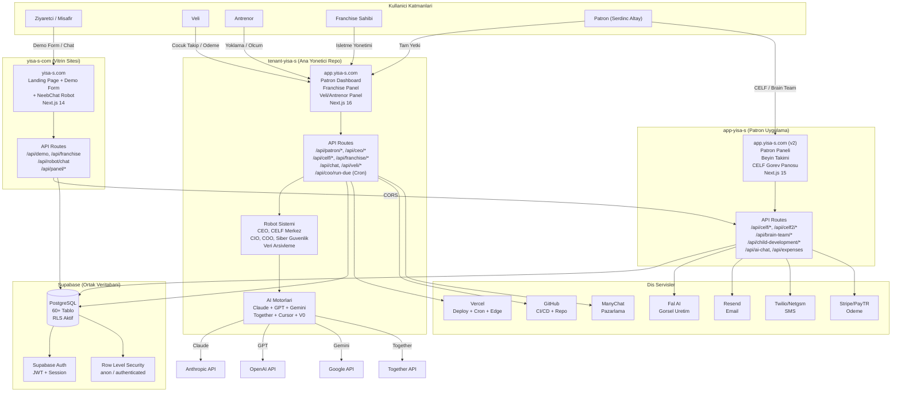
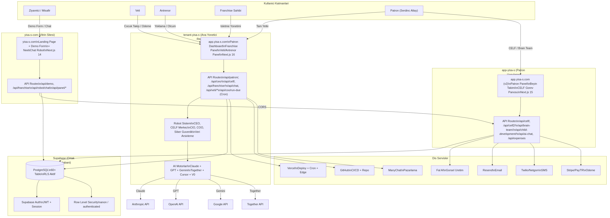
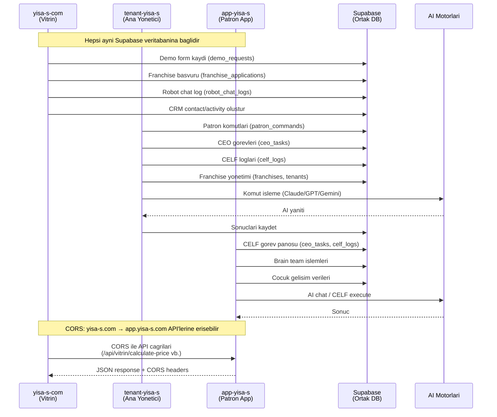
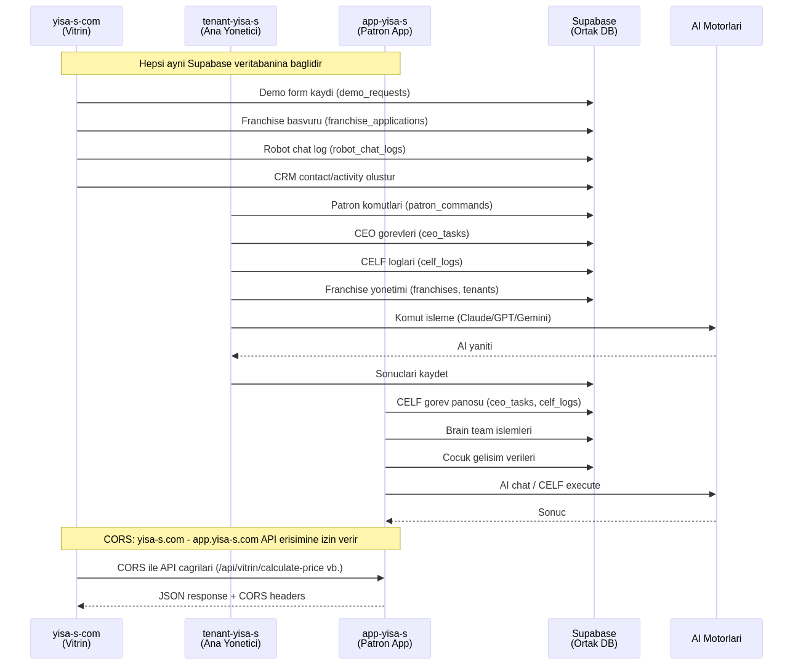
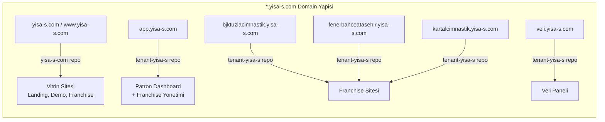
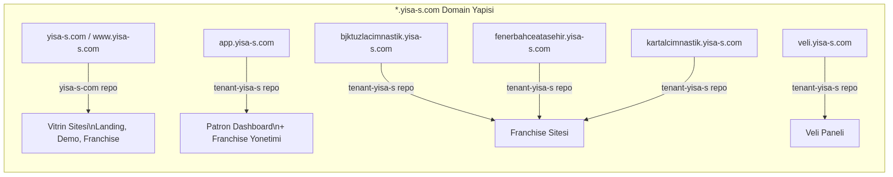
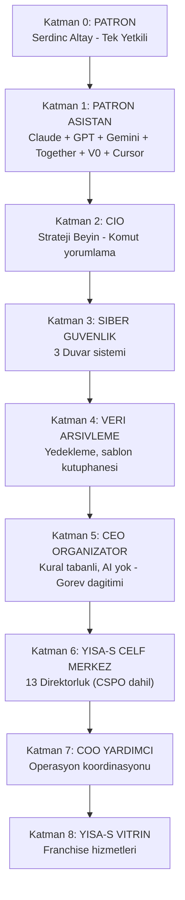
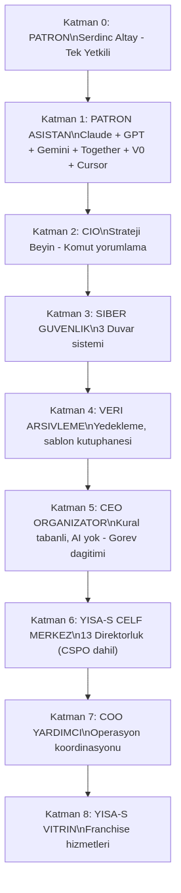
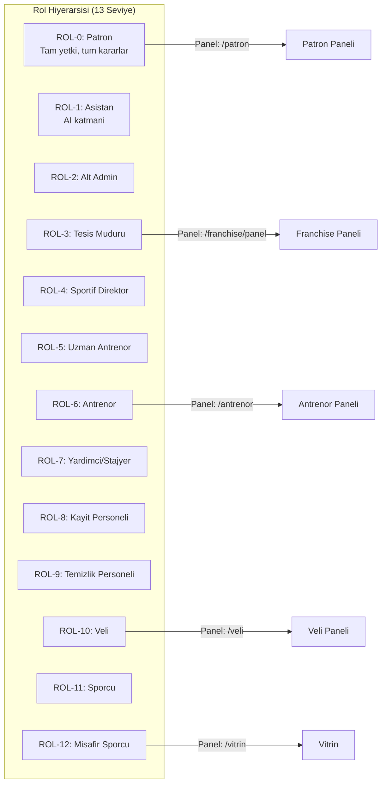
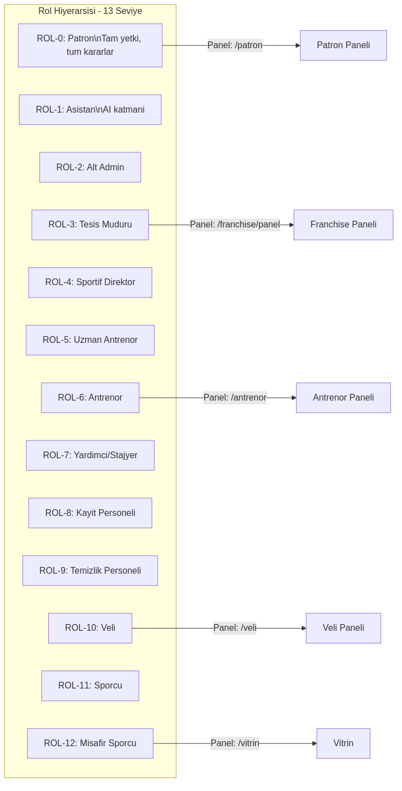

# YiSA-S Kapsamli Proje Dokumantasyonu

> **Tarih:** 24 Subat 2026
> **Repolar:** `app-yisa-s`, `tenant-yisa-s`, `yisa-s-com`
> **Ortak Altyapi:** Supabase (PostgreSQL + Auth + RLS) | Vercel (Deploy) | Next.js

---

## 1. Genel Mimari Sema



> **Gorsel:** 

---

## 2. Repolar Arasi Iletisim Semasi



> **Gorsel:** 

---

## 3. Subdomain Yapilanmasi



> **Gorsel:** 

---

## 4. Veritabani Tablolari (Supabase PostgreSQL)

### 4.1 tenant-yisa-s Tablolari (Ana Sema - 40+ tablo)

| # | Tablo | Aciklama | Onemli Kolonlar |
|---|-------|----------|-----------------|
| **BOLUM 1: Patron / Chat / CEO** | | | |
| 1 | `chat_messages` | Patron-AI sohbet mesajlari | user_id, message, response, ai_providers[] |
| 2 | `patron_commands` | Patron komutlari ve onay durumu | command, status (pending/approved/rejected/modified), decision, ceo_task_id |
| 3 | `ceo_tasks` | CEO'nun yonettigi gorevler | task_description, task_type, director_key, status, result_payload, idempotency_key |
| 4 | `celf_logs` | CELF motor islem loglari | ceo_task_id (FK), director_key, action, input/output_summary, payload |
| 5 | `audit_log` | Sistem denetim kayitlari | action, entity_type, entity_id, user_id, payload |
| **BOLUM 2: CELF Ic Denetim + CEO Merkez** | | | |
| 6 | `patron_private_tasks` | Patron'un ozel gorevleri | patron_id, command, result, is_private |
| 7 | `celf_audit_logs` | CELF ic denetim kayitlari | check_type (data_access/protection/approval/veto), check_result |
| 8 | `director_rules` | Direktorluk kurallari | director_key (UNIQUE), data_access[], protected_data[], has_veto, ai_providers[] |
| 9 | `ceo_routines` | CEO zamanlanmis rutinler | routine_type (rapor/kontrol/bildirim/sync), schedule (daily/weekly/monthly), next_run |
| 10 | `ceo_rules` | CEO is kurallari | rule_type (validation/automation/restriction/notification), condition, action (JSONB) |
| 11 | `ceo_templates` | CEO sablonlari | template_type (rapor/dashboard/ui/email/bildirim), content (JSONB), is_approved |
| 12 | `ceo_approved_tasks` | Onaylanmis gorevler arsivi | task_id, director_key, data_used[], data_changed[], can_become_routine |
| 13 | `ceo_franchise_data` | Franchise'lardan gelen veriler | franchise_id, data_type, data_value (JSONB), period |
| **BOLUM 3: Robot Sistemi** | | | |
| 14 | `routine_tasks` | Zamanlanmis rutin gorevler | task_type, director_key, schedule, next_run, is_active |
| 15 | `task_results` | Gorev sonuclari | routine_task_id (FK), ai_providers[], input_command, output_result, status |
| 16 | `security_logs` | Guvenlik kayitlari | event_type, severity (sari/turuncu/kirmizi/acil), blocked, ip_address |
| **BOLUM 4: Operasyon** | | | |
| 17 | `tenants` | Musteriler / Franchise'lar | ad, slug (UNIQUE), durum (aktif/askida/iptal) |
| 18 | `approval_queue` | Onay kuyrugu | talep_tipi, baslik, durum (bekliyor/onaylandi/reddedildi), oncelik (1-5), payload |
| 19 | `expenses` | Giderler | kategori (api_maliyeti/altyapi/hosting/...), tutar, odeme_durumu, fatura_no |
| 20 | `franchises` | Franchise detaylari | isletme_adi, yetkili_ad/soyad, il/ilce, paket_tipi, ogrenci_sayisi, aylik_gelir |
| 21 | `templates` | Sablon kutuphanesi | kategori (grafik_premium/standart/rapor/form/...), fiyat, kullanim_sayisi |
| 22 | `franchise_revenue` | Franchise gelirleri | gelir_tipi, brut_tutar, yisas_payi, franchise_payi, odeme_durumu |
| 23 | `deploy_logs` | Deploy kayitlari | deploy_tipi, commit_hash, patron_onayli, durum, deploy_url |
| 24 | `api_usage` | API kullanim takibi | api_adi (claude/gpt4/together/...), input/output_tokens, tahmini_maliyet |
| **BOLUM 5: Maliyet + Satis** | | | |
| 25 | `celf_cost_reports` | CELF maliyet raporlari | report_type, cost_breakdown (JSONB), director_key |
| 26 | `patron_sales_prices` | Patron satis fiyatlari | product_key (UNIQUE), sales_price_amount, effective_from/to |
| **BOLUM 6: COO Kurallari** | | | |
| 27 | `coo_rules` | COO operasyon kurallari | operation_type, label, keywords[], director_mapping (JSONB), approved_by |
| **BOLUM 7: Roller** | | | |
| 28 | `role_permissions` | Kullanici rolleri ve yetkileri | role_code (ROL-0..12, PATRON), can_trigger_flow, panel_route, priority |

#### Ek Migrasyonlardan Gelen Tablolar

| # | Tablo | Aciklama |
|---|-------|----------|
| 29 | `athletes` | Sporcular |
| 30 | `attendance` | Yoklama kayitlari |
| 31 | `payments` | Odemeler |
| 32 | `demo_requests` | Demo talepleri |
| 33 | `tenant_templates` | Tenant bazli sablonlar |
| 34 | `staff` | Personel |
| 35 | `athlete_health_records` | Sporcu saglik kayitlari |
| 36 | `celf_kasa` | CELF kasa islemleri |
| 37 | `tenant_settings` | Tenant ayarlari |
| 38 | `v0_template_library` | V0 sablon kutuphanesi |
| 39 | `franchise_subdomains` | Franchise subdomain kayitlari |
| 40 | `students` | Ogrenciler |
| 41 | `seans_packages` | Seans paketleri |
| 42 | `student_attendance` | Ogrenci yoklama |
| 43 | `token_magaza` | Token magazasi |
| 44 | `cash_register` | Kasa defteri |
| 45 | `dijital_kredi` | Dijital kredi sistemi |
| 46 | `gelisim_olcum` | Gelisim olcum kayitlari |
| 47 | `sozlesme_onaylari` | Sozlesme onaylari |
| 48 | `cio_analysis_logs` | CIO analiz loglari |

### 4.2 yisa-s-com Tablolari (Vitrin Semasi)

| # | Tablo | Aciklama |
|---|-------|----------|
| 1 | `app_roles` | Sistem hiyerarsisi (Patron/Asistan/Nis/Data Robot/Security Robot) |
| 2 | `robot_types` | Robot turleri (chat_robot, data_robot, security_robot) |
| 3 | `crm_lead_stages` | CRM asamalari (C, E, O, J-A-O) |
| 4 | `tenants` | Musteriler/Franchise'lar |
| 5 | `branches` | Subeler (tenant'a bagli) |
| 6 | `demo_requests` | Demo talepleri |
| 7 | `franchise_applications` | Franchise basvurulari |
| 8 | `robot_chat_logs` | Robot sohbet loglari (session_id, tenant_id, tokens_used) |
| 9 | `contact_messages` | Iletisim mesajlari |
| 10 | `newsletter_subscribers` | Newsletter aboneleri |
| 11 | `crm_contacts` | CRM birlestirici kisi tablosu (tum kaynaklar) |
| 12 | `crm_activities` | CRM aktiviteleri (chat, demo, franchise, contact) |

### 4.3 app-yisa-s Ek Migrasyonlari

| # | Migrasyon | Aciklama |
|---|-----------|----------|
| 1 | `celf_provider_registry_fix` | CELF provider kayit duzeltmesi |
| 2 | `beyin_takimi` | Beyin takimi tablolari |
| 3 | `fix_legacy_tables` | Eski tablo duzeltmeleri |
| 4 | `company_info_vision_mission` | Sirket bilgileri, vizyon, misyon |
| 5 | `sms_templates` | SMS sablonlari |
| 6 | `package_pricing` | Paket fiyatlandirma |
| 7 | `template_library_usage` | Sablon kullanim takibi |
| 8 | `reference_values` | Referans degerler |
| 9 | `child_development_tables` | Cocuk gelisim tablolari |
| 10 | `audit_log` | Denetim kayitlari |
| 11 | `expenses` | Gider tablolari |

### 4.4 Onemli View'lar

| View | Aciklama |
|------|----------|
| `v_patron_bekleyen_onaylar` | Patron'un bekleyen onaylari (oncelik + bekleme gunu) |
| `v_patron_aylik_gelir` | Aylik gelir ozeti (gelir_tipi bazinda) |
| `v_patron_aylik_gider` | Aylik gider ozeti (kategori bazinda) |
| `v_patron_franchise_ozet` | Franchise durum ozeti |
| `v_patron_son_deploylar` | Son 20 deploy kaydi |
| `v_crm_unified` | CRM birlestirici gorunum (contact + activity) |

---

## 5. lib/ Klasorleri (Yardimci Dosyalar)

### 5.1 app-yisa-s/lib/

| Dosya/Klasor | Aciklama |
|-------------|----------|
| `supabase/client.ts` | Browser Supabase client (createBrowserClient) |
| `supabase/server.ts` | Server-side Supabase client |
| `supabase/admin.ts` | Admin client (SERVICE_ROLE_KEY ile RLS bypass) |
| `supabase/middleware.ts` | Supabase session yonetimi middleware |
| `ai-providers.ts` | **Tum AI providerlari:** Claude, GPT, Cursor, V0, Gemini, Together, Fal AI + Aksiyon providerlari (Vercel Deploy, GitHub, ManyChat, Railway) |
| `cors.ts` | CORS yapilandirmasi (yisa-s.com → app.yisa-s.com) |
| `celf-parse-engine.ts` | CELF komut parse motoru |
| `celf-directorate-config.ts` | CELF direktorluk konfigurasyonu |
| `audit.ts` | Denetim kaydi yardimcilari |
| `env.ts` | Environment degisken yardimcilari |
| `errors.ts` | Hata yonetimi |
| `logger.ts` | Loglama sistemi |
| `dashboard-widgets.ts` | Dashboard widget yardimcilari |
| `sms-provider.ts` | SMS provider (Twilio/Netgsm) |
| `sms-triggers.ts` | SMS tetikleyiciler |
| `celf/c2-plan-rules.ts` | CELF C2 plan kurallari |
| `celf/lease-check.ts` | CELF kiralama kontrolu |
| `celf/patron-auth.ts` | Patron kimlik dogrulama |
| `beyin-takimi/robots.ts` | Beyin takimi robot tanimlari |
| `child-development/scoring.ts` | Cocuk gelisim puanlama |
| `direktorlukler/config.ts` | Direktorluk konfigurasyonu |
| `emails/resend.ts` | Resend email entegrasyonu |
| `middleware/rate-limit.ts` | Rate limiting |
| `types/index.ts` | Tip tanimlari |
| `utils/slug.ts` | Slug yardimcilari |
| `utils.ts` | Genel yardimcilar |

### 5.2 tenant-yisa-s/lib/

| Dosya/Klasor | Aciklama |
|-------------|----------|
| `supabase.ts` | Ana Supabase client (browser + server + mock) |
| `supabase/client.ts` | Browser Supabase client |
| `supabase/server.ts` | Server Supabase client |
| `supabase/middleware.ts` | Supabase middleware |
| `subdomain.ts` | **Subdomain yonetimi** (patron/franchise/veli/www tespit) |
| `franchise-tenant.ts` | Franchise-tenant ID cozumleme |
| `vercel.ts` | **Vercel API** (subdomain eklemek icin) |
| `ai-router.ts` | AI yonlendirici |
| `patron-chat-classifier.ts` | Patron chat siniflandirici |
| `tenant-from-subdomain.ts` | Subdomain'den tenant cozumleme |
| `utils.ts` | Genel yardimcilar |
| **ai/** | |
| `ai/assistant-provider.ts` | Asistan AI provider |
| `ai/celf-pool.ts` | CELF havuzu |
| `ai/celf-execute.ts` | CELF yurutme |
| `ai/claude-service.ts` | Claude servisi |
| `ai/gpt-service.ts` | GPT servisi |
| `ai/gemini-service.ts` | Gemini servisi |
| `ai/claude-denetci.ts` | Claude denetci |
| **api/** | |
| `api/chat-providers.ts` | Chat providerlari |
| `api/cursor-client.ts` | Cursor API client |
| `api/v0-client.ts` | V0 API client |
| `api/github-client.ts` | GitHub API client |
| `api/fal-client.ts` | Fal AI client |
| `api/fetch-with-retry.ts` | Retry mekanizmali fetch |
| **auth/** | |
| `auth/roles.ts` | **Rol sistemi** (13 seviye + Anayasa uyumlu kodlar) |
| `auth/resolve-role.ts` | Rol cozumleme |
| `auth/api-auth.ts` | API kimlik dogrulama |
| **db/** | 20+ veritabani erisim modulu |
| `db/celf-audit.ts` | CELF denetim |
| `db/ceo-celf.ts` | CEO-CELF islemleri |
| `db/chat-messages.ts` | Chat mesaj islemleri |
| `db/franchise-subdomains.ts` | Franchise subdomain DB islemleri |
| `db/sales-prices.ts` | Satis fiyat islemleri |
| `db/security-logs.ts` | Guvenlik log islemleri |
| **robots/** | |
| `robots/hierarchy.ts` | **Robot hiyerarsisi** (9 katman: Patron → COO) |
| `robots/ceo-robot.ts` | CEO robotu |
| `robots/coo-robot.ts` | COO robotu |
| `robots/cio-robot.ts` | CIO robotu |
| `robots/celf-center.ts` | CELF merkez |
| `robots/data-robot.ts` | Veri robotu |
| `robots/security-robot.ts` | Guvenlik robotu |
| `robots/patron-assistant.ts` | Patron asistan |
| `robots/yisas-vitrin.ts` | Vitrin robotu |
| **patron-robot/** | |
| `patron-robot/orchestrator.ts` | Robot orkestratoru |
| `patron-robot/router.ts` | Robot yonlendirici |
| `patron-robot/agents/` | 11 ajan: claude, gemini, gpt, cursor, github, supabase, v0, vercel, together, llamaOnPrem |
| **security/** | |
| `security/forbidden-zones.ts` | Yasak bolgeler |
| `security/patron-lock.ts` | Patron kilidi |
| `security/siber-guvenlik.ts` | Siber guvenlik |

### 5.3 yisa-s-com/lib/

| Dosya/Klasor | Aciklama |
|-------------|----------|
| `supabase.ts` | Supabase client + tip tanimlari (DemoRequest, FranchiseApplication, ContactMessage, NewsletterSubscriber) |
| `supabase-client.ts` | Supabase browser client |
| `supabase-admin.ts` | Admin client (RLS bypass) |
| `akular.ts` | **Aku (Motor) sistemi** - 10 entegrasyon tanimlari ve aktiflik kontrolu |
| `akular-kontrol.ts` | Aku kontrol islemleri |
| `utils.ts` | Genel yardimcilar |
| `knowledge/yisas.ts` | YiSA-S bilgi tabani (NeebChat icin) |

---

## 6. components/ Klasorleri

### 6.1 app-yisa-s/components/

| Klasor/Dosya | Aciklama |
|-------------|----------|
| **ui/** (40+ dosya) | Shadcn/UI bilesenleri: accordion, alert, avatar, badge, button, card, chart, checkbox, dialog, dropdown-menu, form, input, label, pagination, popover, progress, scroll-area, select, separator, sheet, sidebar, skeleton, slider, spinner, switch, table, tabs, textarea, toast, toggle, tooltip vb. |
| **dashboard/** | |
| `DashboardWidgetStrip.tsx` | Dashboard widget seridi |
| `TokenMaliyetWidget.tsx` | Token maliyet widget'i |
| `WidgetlerConfigPanel.tsx` | Widget konfigurasyonu |
| `theme-provider.tsx` | Tema yonetimi |

### 6.2 tenant-yisa-s/components/

| Klasor/Dosya | Aciklama |
|-------------|----------|
| **ui/** (14 dosya) | Temel UI bilesenleri: accordion, avatar, badge, button, card, dropdown-menu, input, label, progress, table, tabs, textarea, tooltip |
| **patron/** | |
| `ApprovalQueue.tsx` | Onay kuyrugu bileşeni |
| `AssistantChat.tsx` | Asistan sohbet paneli |
| `RobotStatusGrid.tsx` | Robot durum izgarası |
| **franchise-panel/** | |
| `dashboard-header.tsx` | Franchise dashboard baslik |
| `stats-overview.tsx` | Istatistik ozeti |
| `franchise-partners.tsx` | Franchise ortaklari |
| `project-management.tsx` | Proje yonetimi |
| `panel-designs.tsx` | Panel tasarimlari |
| **Diger** | |
| `FranchiseIntro.tsx` | Franchise tanitim |
| `VeliIntro.tsx` | Veli tanitim |
| `YisaLogo.tsx` | Logo bileseni |
| `PatronCommandPanel.tsx` | Patron komut paneli |
| `animated-orbs.tsx` | Animasyonlu kure bileseni |

### 6.3 yisa-s-com/components/

| Klasor/Dosya | Aciklama |
|-------------|----------|
| **home/** | Landing sayfa bilesenleri |
| `HeroSection.tsx` | Ana baslik bolumu |
| `FeaturesSection.tsx` | Ozellikler |
| `BranslarSection.tsx` | Branslar |
| `HizmetlerSection.tsx` | Hizmetler |
| `PricingPreview.tsx` | Fiyatlandirma onizleme |
| `StatsSection.tsx` | Istatistikler |
| `CTASection.tsx` | Call-to-action |
| `DemoVideoSection.tsx` | Demo video |
| `PHVSection.tsx` | PHV (Peak Height Velocity) |
| `AIEnginesSection.tsx` | AI motor tanitimi |
| `RobotFaceSection.tsx` | Robot yuz animasyonu |
| **landing/** | Alternatif landing bilesenleri |
| `hero.tsx`, `features.tsx`, `pricing.tsx`, `demo-form.tsx`, `chatbot.tsx`, `branches.tsx`, `club-preview.tsx`, `showcase.tsx`, `navbar.tsx`, `footer.tsx`, `intro.tsx` | |
| **layout/** | |
| `Header.tsx`, `Footer.tsx`, `ConditionalLayout.tsx` | Sayfa duzen bilesenleri |
| **robot/** | |
| `ChatWidget.tsx` | NeebChat robot sohbet widget'i |
| **intro/** | |
| `IntroAnimation.tsx` | Giris animasyonu |
| **ui/** | |
| `button.tsx`, `input.tsx` | Temel UI |

---

## 7. Environment Variables

### 7.1 app-yisa-s (.env.example)

| Degisken | Zorunluluk | Aciklama |
|----------|-----------|----------|
| **Supabase** | | |
| `NEXT_PUBLIC_SUPABASE_URL` | Zorunlu | Supabase proje URL |
| `NEXT_PUBLIC_SUPABASE_ANON_KEY` | Zorunlu | Supabase anon key |
| `SUPABASE_SERVICE_ROLE_KEY` | Zorunlu | Service role key (RLS bypass) |
| `SUPABASE_WEBHOOK_SECRET` | Opsiyonel | Webhook guvenlik anahtari |
| **Email** | | |
| `RESEND_API_KEY` | Opsiyonel | Resend email servisi |
| **SMS** | | |
| `TWILIO_ACCOUNT_SID` | Opsiyonel | Twilio SMS |
| `TWILIO_AUTH_TOKEN` | Opsiyonel | Twilio auth |
| `TWILIO_PHONE_NUMBER` | Opsiyonel | Twilio telefon |
| `NETGSM_USERNAME` | Opsiyonel | Netgsm alternatif |
| `NETGSM_PASSWORD` | Opsiyonel | Netgsm auth |
| **Odeme** | | |
| `STRIPE_SECRET_KEY` | Opsiyonel | Stripe odeme |
| `STRIPE_PUBLISHABLE_KEY` | Opsiyonel | Stripe public key |
| `STRIPE_WEBHOOK_SECRET` | Opsiyonel | Stripe webhook |
| `PAYTR_MERCHANT_ID/KEY/SALT` | Opsiyonel | PayTR alternatif |
| **AI** | | |
| `OPENAI_API_KEY` | Opsiyonel | GPT-4o |
| `ANTHROPIC_API_KEY` | Opsiyonel | Claude |
| `GOOGLE_GEMINI_API_KEY` | Opsiyonel | Gemini |
| `TOGETHER_API_KEY` | Opsiyonel | Together AI |
| `CURSOR_API_KEY` | Opsiyonel | Cursor IDE |
| `V0_API_KEY` | Opsiyonel | Vercel V0 |
| **Diger** | | |
| `BLOB_READ_WRITE_TOKEN` | Opsiyonel | Vercel Blob |
| `NEXT_PUBLIC_APP_URL` | Onerilen | https://app.yisa-s.com |
| `NEXT_PUBLIC_VITRIN_URL` | Onerilen | https://yisa-s.com |
| `RATE_LIMIT_MAX_REQUESTS` | Opsiyonel | Rate limit (varsayilan: 100) |
| `LOG_LEVEL` | Opsiyonel | Log seviyesi |
| `SENTRY_DSN` | Opsiyonel | Hata takip |

### 7.2 tenant-yisa-s (.env.example)

| Degisken | Zorunluluk | Aciklama |
|----------|-----------|----------|
| `NEXT_PUBLIC_SUPABASE_URL` | **Zorunlu** | Supabase URL |
| `NEXT_PUBLIC_SUPABASE_ANON_KEY` | **Zorunlu** | Supabase anon key |
| `SUPABASE_SERVICE_ROLE_KEY` | **Zorunlu** | RLS bypass icin |
| `DATABASE_URL` | Migrasyon icin | PostgreSQL connection string |
| `GOOGLE_API_KEY` | AI icin | Gemini API |
| `OPENAI_API_KEY` | AI icin | GPT API |
| `ANTHROPIC_API_KEY` | AI icin | Claude API |
| `TOGETHER_API_KEY` | AI icin | Together AI |
| `V0_API_KEY` | Opsiyonel | Vercel V0 |
| `CURSOR_API_KEY` | Opsiyonel | Cursor |
| `GITHUB_TOKEN` | Opsiyonel | GitHub erisim |
| `VERCEL_TOKEN` | Opsiyonel | Vercel deploy + subdomain |
| `VERCEL_PROJECT` | Opsiyonel | Varsayilan: yisa-s-app |
| `CRON_SECRET` | Opsiyonel | Vercel Cron guvenlik |
| `MANYCHAT_API_KEY` | Opsiyonel | ManyChat pazarlama |
| `FAL_API_KEY` | Opsiyonel | Fal AI gorsel uretim |
| `NEXT_PUBLIC_SITE_URL` | Opsiyonel | Patron panel domain |
| `NEXT_PUBLIC_PATRON_EMAIL` | Opsiyonel | Patron e-postasi |

### 7.3 yisa-s-com (.env.example)

| Degisken | Zorunluluk | Aciklama |
|----------|-----------|----------|
| `ANTHROPIC_API_KEY` | AI icin | Claude (NeebChat) |
| `OPENAI_API_KEY` | AI icin | GPT |
| `TOGETHER_API_KEY` | AI icin | Together |
| `GOOGLE_GENERATIVE_AI_API_KEY` | AI icin | Gemini |
| `NEXT_PUBLIC_SUPABASE_URL` | **Zorunlu** | Supabase URL |
| `NEXT_PUBLIC_SUPABASE_ANON_KEY` | **Zorunlu** | Supabase anon key |
| `SUPABASE_SERVICE_ROLE_KEY` | Onerilen | Panel listeleri icin |
| `NEXT_PUBLIC_SITE_URL` | Onerilen | https://yisa-s.com |

---

## 8. Vercel Deployment Ayarlari

### 8.1 tenant-yisa-s/vercel.json

```json
{
  "framework": "nextjs",
  "buildCommand": "npm run build",
  "installCommand": "npm install",
  "crons": [
    {
      "path": "/api/coo/run-due",
      "schedule": "0 2 * * *"
    }
  ]
}
```

- **Cron Job:** Her gun saat 02:00 UTC'de `/api/coo/run-due` cagirilir (COO zamanlanmis gorevler)

### 8.2 yisa-s-com/vercel.json

```json
{
  "framework": "nextjs",
  "buildCommand": "npm run build",
  "installCommand": "npm install"
}
```

### 8.3 app-yisa-s

- `vercel.json` **yok** - varsayilan Vercel Next.js ayarlari kullanilir

### 8.4 next.config Dosyalari

| Repo | Dosya | Ozellikler |
|------|-------|-----------|
| **app-yisa-s** | `next.config.mjs` | TypeScript hatalari ignore, unoptimized images, **CORS headers** (/api/* icin yisa-s.com origin'ine izin) |
| **tenant-yisa-s** | `next.config.js` | reactStrictMode, rewrite: /manifest.json → /api/manifest (PWA) |
| **yisa-s-com** | `next.config.js` | reactStrictMode, images domains: ['yisa-s.com'] |

### 8.5 Ek Deploy Yapilandirmalari

| Repo | Dosya | Aciklama |
|------|-------|----------|
| tenant-yisa-s | `railway.toml` | Railway alternatif deploy |
| tenant-yisa-s | `nixpacks.toml` | Nixpacks build konfigurasyonu |
| yisa-s-com | `railway.toml` | Railway alternatif deploy |

---

## 9. Robot Hiyerarsisi ve AI Sistemi



> **Gorsel:** 

### AI Motorlari Kullanim Alanlari

| Motor | Kullanim | Repo |
|-------|---------|------|
| **Claude** (Anthropic) | NeebChat varsayilan, derin analiz, denetci | yisa-s-com, tenant-yisa-s, app-yisa-s |
| **GPT-4o** (OpenAI) | Hizli iletisim, icerik uretimi | tenant-yisa-s, app-yisa-s |
| **Gemini** (Google) | Gorsel analiz, video/foto hareket analizi | tenant-yisa-s, app-yisa-s |
| **Together AI** | Ekonomik, yuksek hacimli rutin gorevler (Llama 3.1) | tenant-yisa-s, app-yisa-s |
| **V0** (Vercel) | UI bileseni uretimi | tenant-yisa-s, app-yisa-s |
| **Cursor** | Kod uretimi (GPT fallback) | tenant-yisa-s, app-yisa-s |
| **Fal AI** | Gorsel uretim (Flux/Schnell) | tenant-yisa-s, app-yisa-s |

---

## 10. Kullanici Rolleri ve Erisim Matrisi



> **Gorsel:** 

| Rol | Flow Tetikleme | CELF/CEO | Max Bekleyen Is | Oncelik |
|-----|---------------|----------|----------------|---------|
| Patron | Evet | Evet | 99 | 1 (en yuksek) |
| Franchise Sahibi | Hayir | Hayir | 1 | 7 |
| Tesis Muduru | Hayir | Hayir | 1 | 8 |
| Veli | Hayir | Hayir | 0 | 9 |
| Sporcu | Hayir | Hayir | 0 | 9 |
| Ziyaretci | Hayir | Hayir | 0 | 10 |

---

## 11. Sayfa/Route Yapisi

### 11.1 app-yisa-s Sayfalari

| Route | Aciklama |
|-------|----------|
| `/` | Ana sayfa |
| `/patron/dashboard` | Patron dashboard (demo talepleri dahil) |
| `/patron/beyin-takimi` | Beyin takimi (AI sohbet + karar tablosu) |
| `/patron/celf` | CELF motor paneli |
| `/patron/direktorlukler` | Direktorlukler listesi |
| `/patron/direktorlukler/[slug]` | Direktorluk detay |
| `/patron/komut-merkezi` | Komut merkezi |
| `/patron/onay-kuyrugu` | Onay kuyrugu |
| `/patron/tasks` | Gorev kanban panosu |
| `/patron/tasks/[id]` | Gorev detay |
| `/patron/tenants` | Tenant yonetimi |
| `/patron/tenants/[id]` | Tenant detay |
| `/patron/status` | Sistem durum |
| `/dashboard/beyin-takimi` | Dashboard beyin takimi |
| `/dashboard/gorev-panosu` | Gorev panosu |
| `/dashboard/kasa-defteri` | Kasa defteri |
| `/dashboard/komut-merkezi` | Komut merkezi |
| `/vitrin` | Vitrin sayfasi |

### 11.2 tenant-yisa-s Sayfalari

| Route | Aciklama |
|-------|----------|
| `/` | Ana sayfa (subdomain'e gore yonlendirme) |
| `/auth/login` | Giris |
| `/patron` | Patron giris |
| `/dashboard/*` | Patron dashboard (15+ alt sayfa) |
| `/franchise` | Franchise paneli |
| `/panel/*` | Franchise isletme paneli (ogrenciler, odemeler, yoklama, program, aidat) |
| `/antrenor/*` | Antrenor paneli (sporcular, yoklama, olcum) |
| `/veli/*` | Veli paneli (cocuk, gelisim, kredi, duyurular) |
| `/vitrin` | Vitrin |
| `/kasa/*` | Kasa defteri + rapor |
| `/sozlesme/*` | Sozlesme (franchise, personel, veli) |
| `/demo` | Demo sayfasi |
| `/fiyatlar` | Fiyatlandirma |
| `/kurulum` | Kurulum |
| `/magaza` | Token magazasi |
| `/personel` | Personel yonetimi |
| `/tesis` | Tesis yonetimi |
| `/uye-ol` | Uye kayit |

### 11.3 yisa-s-com Sayfalari

| Route | Aciklama |
|-------|----------|
| `/` | Landing page (hero, features, pricing vb.) |
| `/demo` | Demo talep formu |
| `/franchise` | Franchise tanitim + basvuru |
| `/fiyatlandirma` | Fiyatlandirma |
| `/ozellikler` | Ozellikler |
| `/hakkimizda` | Hakkimizda |
| `/blog` | Blog |
| `/fuar` | Fuar sayfasi |
| `/robot` | NeebChat robot tanitim |
| `/sablonlar` | Sablon galeri |
| `/akular` | Aku (motor) durum sayfasi |
| `/giris` | Giris |
| `/auth/login` | Auth login |
| `/panel/*` | Admin panel (demo-listesi, bayilik-listesi) |

---

## 12. Middleware ve Guvenlik

### app-yisa-s/middleware.ts
- **CORS:** Vitrin (yisa-s.com) → Patron API OPTIONS preflight + response headers
- **Subdomain routing:** app (patron), tenant (franchise), www/vitrin
- **Session:** Supabase session yonetimi (updateSession)
- **Header:** `x-tenant-context`, `x-subdomain` header'lari

### yisa-s-com/middleware.ts
- **Panel koruma:** `/panel/*` yollari Supabase session gerektirir
- **Yonlendirme:** Oturum yoksa → `/giris`
- **Matcher:** Sadece `/panel` ve alt yollar

### tenant-yisa-s
- Supabase SSR middleware (`lib/supabase/middleware.ts`)
- Subdomain bazli panel tespiti (`lib/subdomain.ts`)
- API auth (`lib/auth/api-auth.ts`)
- Guvenlik: Yasak bolgeler, patron kilidi, siber guvenlik (`lib/security/`)

---

## 13. Paket Bagimliliklari Ozeti

| Ozellik | app-yisa-s | tenant-yisa-s | yisa-s-com |
|---------|-----------|---------------|------------|
| **Next.js** | 15.5.10 | 16.1.6 | 14.2.0 |
| **React** | 19.2.0 | 18.2.0 | 18.2.0 |
| **Supabase JS** | latest | 2.45.0 | 2.45.0 |
| **Supabase SSR** | latest | 0.5.0 | 0.5.0 |
| **UI Framework** | Radix UI + Shadcn (40+ bileseni) | Radix UI + Shadcn (temel) | Minimal |
| **AI SDK** | ai (Vercel) | @anthropic-ai/sdk, @google/generative-ai, openai | @anthropic-ai/sdk |
| **Animasyon** | - | framer-motion | framer-motion |
| **Grafik** | recharts | - | - |
| **Form** | react-hook-form + zod | - | - |
| **GitHub** | - | @octokit/rest | - |
| **Markdown** | react-syntax-highlighter | react-markdown | - |
| **Drag & Drop** | @dnd-kit | - | - |
| **Analytics** | @vercel/analytics | @vercel/speed-insights | - |
| **DB Migration** | - | pg (devDependency) | - |

---

## 14. Ozet

```
YiSA-S Ekosistemi
|
|-- yisa-s-com (Vitrin)
|   |-- Landing page, Demo form, Franchise basvuru
|   |-- NeebChat robot (Claude varsayilan)
|   |-- CRM sistemi (lead stages: C/E/O/J-A-O)
|   |-- Admin panel (demo listesi, bayilik listesi)
|   |-- Deploy: Vercel + Railway (alternatif)
|
|-- tenant-yisa-s (Ana Yonetici)
|   |-- Patron Dashboard (15+ sayfa)
|   |-- Franchise Paneli (ogrenci, odeme, yoklama, program)
|   |-- Veli Paneli (cocuk, gelisim, kredi)
|   |-- Antrenor Paneli (sporcular, yoklama, olcum)
|   |-- Robot Sistemi (9 katman hiyerarsi)
|   |-- CELF Merkez (13 direktorluk)
|   |-- AI Motor Entegrasyonu (7 AI + 4 aksiyon provider)
|   |-- Subdomain Yonetimi (franchise bazli)
|   |-- Vercel Cron (COO gorevler: gunluk 02:00 UTC)
|   |-- Deploy: Vercel + Railway (alternatif)
|
|-- app-yisa-s (Patron Uygulama)
|   |-- Patron ozel dashboard
|   |-- Beyin Takimi (AI multi-provider chat)
|   |-- CELF v2 gorev panosu (kanban)
|   |-- Cocuk gelisim modulu
|   |-- CORS: yisa-s.com'dan API erisimi
|   |-- Deploy: Vercel
|
|-- Supabase (Ortak)
    |-- 60+ tablo, 6+ view
    |-- RLS (Row Level Security) aktif
    |-- Auth (JWT + session)
    |-- Roller: 13 seviye (Patron → Misafir Sporcu)
```
