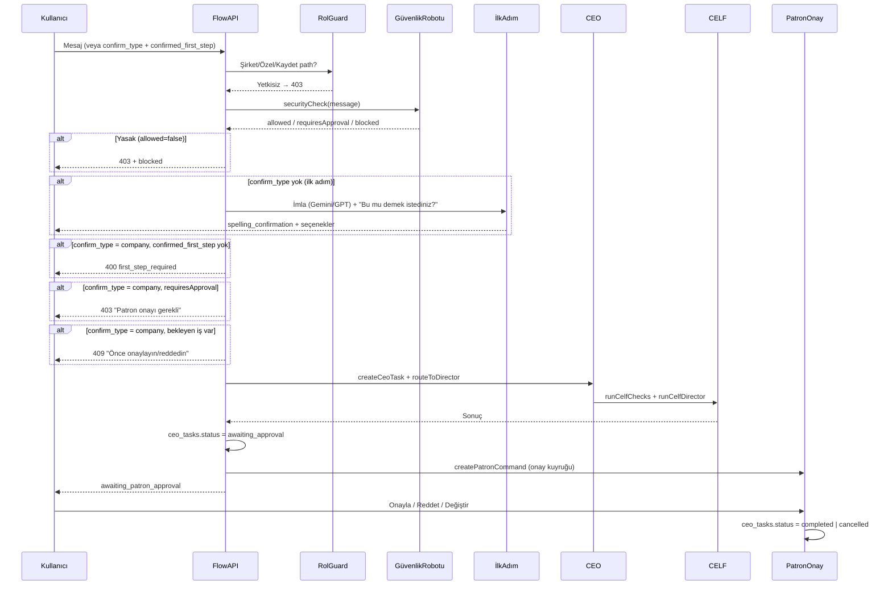

# YİSA-S — Kapsamlı Sistem Dokümantasyonu (Buraya Kadar Olan Kısım)

**Patron:** Serdinç ALTAY  
**Tarih:** 30 Ocak 2026  
**Encoding:** UTF-8 (Türkçe karakterler için bu dosya UTF-8 olarak kaydedilmelidir.)  
**Amaç:** Şu ana kadar ne yapıldı, ne beklendi, nerede kaldık, hangi görevler/roller eklenecek — tek dosyada kayıt altına almak.

---

## İÇİNDEKİLER

| Bölüm | İçerik |
|-------|--------|
| — | **Mimari Anayasa** (PATRON ≠ rol; sistem sahibi) |
| — | **Şirket işi akış şeması** (CEO → Güvenlik → CELF → Patron Onay, Mermaid) |
| 1 | Yapılanlar (ne yapmışız, ne etmişiz) |
| 2 | Beklentiler (ne beklemişiz) |
| 3 | Nerede kaldık (mevcut durum) |
| 4 | Eklenecekler (görevler, roller, dokümanlar) |
| 4.1 | Bekleyen iş ve onay statü standardı (ceo_tasks.status tek kaynak) |
| 5 | Dosya ve referans haritası |
| 6 | Tek özet yol (hızlı referans) |

---

## MİMARİ ANAYASA (PATRON ve Rol)

**Tek cümlelik anayasa:** PATRON bir rol kodu değildir; sistem sahibidir. Rol = yetki seviyesi (ROL-0 … ROL-12, panel/uygulama erişimi); Patron = tek karar verici, flow/CELF/onay zincirinin sahibi. Kod ve veritabanında Patron tanımı e-posta veya ayrı bir bayrak (örn. `is_patron`) ile yapılabilir; rol tablosundaki "PATRON" girişi bu üst yetkiyi temsil eder, diğer rollerle aynı sırada sayılmaz. Bu ayrım dokümantasyon, güvenlik ve flow guard için referans alınır.

---

## ŞİRKET İŞİ AKIŞI: CEO → Güvenlik Robotu → CELF → Patron Onay

Aşağıdaki şema, şirket işi path’inde kimin ne zaman devreye girdiğini tek bakışta gösterir (30 Ocak 2026 son hâli).

- **Rol guard:** Flow (Şirket/Özel/Kaydet) sadece Patron ve tanımlı üst roller (Süper Admin, Sistem Admini) tetikleyebilir.
- **Güvenlik robotu:** Her istekte çalışır; yasak → 403, Patron onayı gerektiren işlem (deploy/commit/SQL vb.) → CELF’e gönderilmez, 403.
- **İlk adım kilidi:** Şirket işi için `confirmed_first_step: true` zorunlu; yoksa 400.
- **Tek bekleyen iş:** Aynı kullanıcı için bekleyen CEO görevi varsa yeni şirket işi açılmaz, 409.
- **Onay tek kaynak:** `ceo_tasks.status` (awaiting_approval → completed | cancelled); Patron kararı bu tabloyu günceller.

---

# 1. YAPILANLAR (Ne yapmışız, ne etmişiz)

## 1.1 Temel sistem kurulumu

| Öğe | Durum | Nerede / Nasıl |
|-----|--------|----------------|
| Next.js 14, React 18, TypeScript | ✅ | `package.json`, `app/`, `lib/` |
| Supabase Auth + veritabanı | ✅ | `.env.local`, `lib/supabase.ts`, `supabase/*.sql` |
| Dashboard, sidebar, sayfalar | ✅ | `app/dashboard/`, menü sayfaları |
| Tek SQL script (tüm tablolar) | ✅ | `supabase/YISA-S_TUM_TABLOLAR_TEK_SQL.sql` — idempotent, tek seferde çalıştırılır |
| Rol tablosu (role_permissions) | ✅ | Aynı SQL içinde; ROL-0 … PATRON varsayılan rolleri |
| CELF maliyet + satış tabloları | ✅ | `celf_cost_reports`, `patron_sales_prices` (tek SQL) |
| CELF/COO dinamik kurallar tabloları | ✅ | `director_rules`, `coo_rules` (tek SQL) |

## 1.2 Asistan ve AI orkestrasyonu

| Öğe | Durum | Nerede |
|-----|--------|--------|
| İlk adım = Gemini (imla düzeltme) | ✅ Kilitli | `ASISTAN_ILK_ADIM_GEMINI_KILIT.md`, `lib/ai/gpt-service.ts` — önce Gemini, yoksa GPT |
| Tek ağız = Gemini (vizyon) | ✅ | `PATRON_ASISTAN_VIZYON_SEMA.md` — panelde konuşan ağız Gemini |
| API’ler sadece Asistan + CELF | ✅ Kilitli | `API_SADECE_ASISTAN_CELF_KURULUM.md`, `.cursor/rules/api-sadece-asistan-celf.mdc` |
| CELF orkestratör = Gemini | ✅ | `lib/ai/celf-execute.ts` — Gemini önce cevaplar veya `DELEGATE:API_NAME` ile diğer API’lere gönderir |
| Gemini model güncellemesi | ✅ | `gemini-2.0-flash` (birincil), `gemini-pro` (yedek); eski 1.5-flash kaldırıldı |
| API hata raporlama | ✅ | CELF/Asistan hataları kullanıcıya net mesaj (örn. "GOOGLE_API_KEY yok", "model not found") |
| DELEGATE satırı temizleme | ✅ | CELF yanıtında "DELEGATE:..." satırları kullanıcıya gösterilmez |

**Gemini model tanımı (tek referans):** Birincil model **gemini-2.0-flash**; yedek (fallback) model **gemini-pro**. Eski modeller (örn. gemini-1.5-flash) kullanılmıyor. Kod ve ortam değişkenleri bu tanıma göre güncellenir.

## 1.3 Ortam ve anahtarlar

| Öğe | Durum | Nerede |
|-----|--------|--------|
| Tek set API anahtarı | ✅ | `.env.local` — Asistan ve CELF aynı anahtarları kullanır (GOOGLE_API_KEY, OPENAI_API_KEY, ANTHROPIC_API_KEY, TOGETHER_API_KEY) |
| .env örneği | ✅ | `.env.example` — tek set; ayrı ASISTAN_* / CELF_* yok |
| Health endpoint | ✅ | `GET /api/health` — env durumu, Supabase bağlantısı, özet; çalışmıyorsa neden burada |

## 1.4 Veritabanı katmanı ve API route’lar

| Öğe | Durum | Dosya / endpoint |
|-----|--------|-------------------|
| Maliyet raporları | ✅ | `lib/db/cost-reports.ts`, `GET/POST /api/cost-reports` |
| Satış fiyatları (Patron) | ✅ | `lib/db/sales-prices.ts`, `GET/PATCH /api/sales-prices` |
| Chat mesajları | ✅ | `lib/db/chat-messages.ts`, chat flow |
| CEO / CELF / patron komutları | ✅ | `lib/db/ceo-*.ts`, `patron_commands`, `ceo_tasks`, `celf_logs` |
| Director rules (dinamik) | ✅ | `lib/db/director-rules-db.ts`, `lib/robots/celf-config-merged.ts` |
| Onay kuyruğu, franchise, expenses, templates | ✅ | İlgili API route’lar ve tablolar |

## 1.5 Dokümantasyon ve Cursor kuralları

| Öğe | Durum | Dosya |
|-----|--------|--------|
| Patron Asistan vizyon şeması | ✅ | `PATRON_ASISTAN_VIZYON_SEMA.md` |
| API sadece Asistan + CELF | ✅ | `API_SADECE_ASISTAN_CELF_KURULUM.md` |
| CELF/COO dinamik kurallar, Patron onayı | ✅ | `CELF_COO_KURALLARI_DINAMIK.md` |
| Patron / franchise ayrımı | ✅ | `PATRON_VE_FRANCHISE_AYRIMI.md` |
| İlk adım Gemini kilidi | ✅ | `ASISTAN_ILK_ADIM_GEMINI_KILIT.md` |
| Env + Tek SQL özeti | ✅ | `ENV_VE_TEK_SQL.md` |
| Tek özet yol | ✅ | `TEK_OZET_YOL.md` |
| Cursor kuralları | ✅ | `.cursor/rules/*.mdc` (api-sadece-asistan-celf, ilk-adim-gemini-kilit, kural-degisikligi-patron-onayi, patron-tek-franchise-ayrim, vb.) |
| Master doküman (v2.1 taslak) | ✅ | `YISA-S-MASTER-DOKUMAN-v2.1-TASLAK.md` |

## 1.6 Robotlar (kod tarafı)

| Robot / Katman | API çağrısı? | Dosya |
|----------------|--------------|--------|
| Asistan (flow) | Evet (Gemini, GPT, Claude vb.) | `app/api/chat/flow/route.ts`, `lib/ai/gpt-service.ts`, `lib/ai/*.ts` |
| CELF | Evet (Gemini orkestratör, DELEGATE ile diğer API’ler) | `lib/ai/celf-execute.ts` |
| CEO | Hayır (kurallar, CELF tetiklemesi) | `lib/robots/ceo-robot.ts` |
| COO | Hayır (CELF’i çağırır; API CELF içinde) | `lib/robots/coo-robot.ts`, `app/api/coo/run-due/route.ts` |
| Güvenlik robotu | Hayır | `lib/robots/security-robot.ts` |
| Veri robotu | Hayır | `lib/robots/data-robot.ts` |

---

# 2. BEKLENTİLER (Ne beklemişiz)

- **Tek ağız:** Panelde konuşan = Gemini; arkada tüm API’ler (Claude, GPT, Together, V0, Cursor, GitHub, Vercel, Supabase, Railway) Asistan ve CELF içinde; görevlendirmeyi Gemini yapar.
- **İlk adım:** Her Patron mesajında önce imla düzeltmesi (“Bu mu demek istediniz?”) + [Şirket İşi] [Özel İş] [Hayır Düzelt]; bu adımda öncelik Gemini, yoksa GPT.
- **Özel iş:** Asistan içinde kalır; CELF’e gitmez; sonuç Patron’a döner; istenirse kayıt (patron_private vb.).
- **Şirket işi:** CEO → CELF (Gemini orkestratör, direktörlükler, API’ler) → sonuç CEO → Gemini → Patron onayı (Onayla / Reddet / Düzelt / Öneri).
- **CELF görevlendirme:** Hangi alan/direktörlük → hangi API’ler; dinamik, sadece **Patron onayı** ile değiştirilir; rutine bağlanamaz.
- **Deploy / commit / SQL:** Sadece Patron onayı; otomatik deploy/commit yasak; güvenlik robotu uygun görürse işlem yapar, kaydeder.
- **Çalışmazsa neden:** Sistem kendi mekanizmasıyla söylesin; `/api/health` ile env ve Supabase durumu + sebep.

---

# 3. NEREDE KALDIK (Mevcut durum)

- **Kod:** İlk adım Gemini, CELF orkestratör Gemini, API sadece Asistan+CELF, hata mesajları, DELEGATE temizleme — uygulandı.
- **Veritabanı:** Tek SQL script hazır; Supabase’te bir kez çalıştırılması yeterli.
- **Ortam:** Tek set API anahtarı `.env.local`; Vercel’de Production env’lerin tanımlı olması gerekiyor.
- **Dashboard:** Sohbet, Onay Kuyruğu, Franchise’lar, Kasa Defteri, Şablonlar vb. sayfalar mevcut; akış testi (imla → Özel/Şirket → CELF → onay) yapılabilir.
- **Rol sistemi:** Tablo ve doküman (Master v2.1, KULLANICI_ROLLERI_SISTEM_ONERILERI) var; flow/API tarafında rol kontrolü ve güvenlik robotu rol logu/engeli tam uygulanması “eklenecekler” kısmında.
- **Güvenlik robotu:** Deploy/commit/SQL’in güvenlik robotundan geçmesi vizyonda; detay implementasyon ve test kaldı.

---

# 4. EKLENECEKLER (Görevler, roller, dokümanlar)

## 4.1 Görevler (yapılacak işler)

### Bekleyen iş ve onay statü standardı (tek referans)

**Doğruluk kaynağı:** Şirket işi ve Patron onayı için tek statü kaynağı **`ceo_tasks.status`** kabul edilir.

| Statü | Anlamı |
|-------|--------|
| `pending` | Oluşturuldu, henüz atanmadı |
| `assigned` | CEO atadı, CELF’e gidecek |
| `celf_running` | CELF işliyor |
| `awaiting_approval` | CELF bitti, Patron onayı bekleniyor |
| `completed` | Patron onayladı |
| `failed` | İşlem hata ile sonlandı |
| `cancelled` | Patron reddetti |

**Tek bekleyen iş kuralı:** Aynı kullanıcı için `status` değeri `pending`, `assigned`, `celf_running` veya `awaiting_approval` olan **en fazla bir** `ceo_tasks` kaydı bulunabilir. Yeni şirket işi açılmadan önce bu sayı kontrol edilir; 1 veya fazlaysa 409 dönülür. `patron_commands` ve onay ekranı bu statüye göre okunur; onay/red sonrası `ceo_tasks.status` güncellenir (completed / cancelled).

---

| Sıra | Görev | Açıklama | Öncelik |
|------|--------|-----------|---------|
| 1 | Rol kontrolü flow API | Patron (ve tanımlı üst roller) dışında flow tetikleyemez; yetkisiz 403 | Yüksek |
| 2 | Güvenlik robotu rol logu / engeli | Her istekte rol bilgisi; yetkisiz CELF/CEO tetiklemesi engelle | Yüksek |
| 3 | CEO’da rol ile kayıt / red | Gelen isteğin user_id + rol bilgisi ile kayıt; rol dışı işlem red | Yüksek |
| 4 | Deploy/commit/SQL → güvenlik robotu | Patron onaylı işlerin deploy/commit/SQL komutlarını güvenlik robotuna gönder; uygun görürse yap, kaydet | Orta |
| 5 | Görev çakışması / tek bekleyen iş | Aynı kullanıcı aynı anda aynı tip bekleyen işte tek kayıt veya kuyruk kuralı | Orta |
| 6 | Rol → sayfa eşlemesi (role_permissions) | Vitrin/franchise paneli yönlendirmesi tek config’ten | Orta |
| 7 | CELF/COO kural değişikliği UI | director_rules / coo_rules güncelleme sadece Patron onayı ile (zaten kural dokümanda) | Düşük |
| 8 | Rate limit / API kullanım logu | Rol bazlı (ileride); api_usage loglama | Düşük |

## 4.2 Roller (sistemde tanımlı / eklenecek)

**PATRON anayasa maddesi (referans):** PATRON bir rol kodu değildir; sistem sahibidir. Rol = yetki seviyesi (ROL-0 … ROL-12); Patron = tek karar verici, flow/CELF/onay zincirinin sahibi. Kod ve veritabanında Patron tanımı e-posta veya ayrı bayrak (örn. `is_patron`) ile yapılır; rol tablosundaki "PATRON" girişi bu üst yetkiyi temsil eder, diğer rollerle aynı sırada sayılmaz.

- **Mevcut (tek SQL):** role_permissions içinde ROL-0 (Ziyaretçi) … ROL-12 (Misafir Sporcu), PATRON.
- **ROL-10, ROL-11:** Rezerve; şu an kullanılmıyor. İleride atanacak rol isimleri için numara ayrılmıştır.
- **Master Doküman (v2.1):** PATRON (sistemde ayrı rol kodu yok, üst yetkili), ROL-1 Alt Admin (Franchise Sahibi), ROL-2 Tesis Müdürü, ROL-3 Bölge Müdürü, ROL-4 Sportif Direktör, ROL-5 Uzman Antrenör, ROL-6 Antrenör, ROL-7 Yardımcı/Stajyer, ROL-8 Kayıt Personeli, ROL-9 Temizlik, ROL-0 Ziyaretçi, ROL-12 Misafir Sporcu.
- **Eklenecek (kod tarafı):** Tüm panel/API’nin bu rollere göre erişim ve yönlendirme kullanması; flow ve CELF/CEO tetiklemesinde rol kontrolü (yukarıdaki görevler 1–3).

## 4.3 Doküman güncellemeleri

- Bu doküman (`YISA-S_KAPSAMLI_SISTEM_DOKUMANTASYONU.md`) ileride “yapılanlar” ve “eklenecekler” bölümleri güncellenerek güncel durum kaydı tutulacak.
- Rol kuralları onaylandıktan sonra `.cursor/rules/kullanici-rolleri-sistem.mdc` eklenebilir (KULLANICI_ROLLERI_SISTEM_ONERILERI.md’de yazıldığı gibi).

---

# 5. DOSYA VE REFERANS HARİTASI

| Konu | Ana dosya(lar) |
|------|-----------------|
| Buraya kadar özet (bu doküman) | `YISA-S_KAPSAMLI_SISTEM_DOKUMANTASYONU.md` |
| Tek özet yol (hızlı bakış) | `TEK_OZET_YOL.md` |
| İlk adım Gemini kilidi | `ASISTAN_ILK_ADIM_GEMINI_KILIT.md` |
| Vizyon şeması (Asistan, CELF, CEO, COO) | `PATRON_ASISTAN_VIZYON_SEMA.md` |
| API sadece Asistan + CELF | `API_SADECE_ASISTAN_CELF_KURULUM.md` |
| CELF/COO dinamik kurallar | `CELF_COO_KURALLARI_DINAMIK.md` |
| Patron / franchise ayrımı | `PATRON_VE_FRANCHISE_AYRIMI.md` |
| Env + Tek SQL | `ENV_VE_TEK_SQL.md` |
| Master doküman (iş kuralları, roller, robotlar) | `YISA-S-MASTER-DOKUMAN-v2.1-TASLAK.md` |
| Rol önerileri (onay bekleyen) | `KULLANICI_ROLLERI_SISTEM_ONERILERI.md` |
| Şu an durum / devam | `SUAN_DURUM_VE_DEVAM.md`, `SISTEM_DURUM_OZET.md` |
| Veritabanı (tek script) | `supabase/YISA-S_TUM_TABLOLAR_TEK_SQL.sql` |
| Cursor kuralları | `.cursor/rules/*.mdc` |
| Chat flow girişi | `app/api/chat/flow/route.ts` |
| CELF çalıştırıcı | `lib/ai/celf-execute.ts` |
| Sağlık kontrolü | `GET /api/health` |

---

# 6. TEK ÖZET YOL (Hızlı referans)

1. **Veritabanı (bir kez):** Supabase Dashboard → SQL Editor → `YISA-S_TUM_TABLOLAR_TEK_SQL.sql` tamamını yapıştır → Run.
2. **Ortam:** `.env.local` — GOOGLE_API_KEY, OPENAI_API_KEY, ANTHROPIC_API_KEY, TOGETHER_API_KEY, Supabase URL/keys tanımlı; değişiklikten sonra `npm run dev` ile yeniden başlat.
3. **Kontrol:** `GET /api/health` — env ve Supabase durumu; çalışmıyorsa neden orada.
4. **Akış testi:** Dashboard sohbet → mesaj yaz → “Bu mu demek istediniz?” + imla (sağlayıcı: Gemini veya GPT) → Şirket işi → CEO → CELF → Patron onayı.

---

**Döküman sonu.**  
Bu dosya “buraya kadar olan kısmı” kaydeder; ileride yapılanlar ve eklenecekler bölümleri güncellenerek güncel tutulacaktır.
