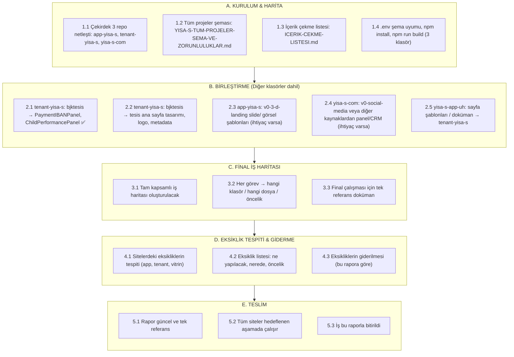

# YİSA-S — İş Akışı, Aşamalar ve Final Harita

> **Kural:** Bu raporun dışına çıkılmayacak. Tüm çalışma bu akışa ve haritaya göre ilerleyecek; iş bu raporla bitirilecek.

> **Vizyon referansı:** Bu sistem **YISA-S-PROJE-SEMA-VE-DURUM (3).md** vizyonu ile ilerliyor (genel mimari, repolar arası iletişim, subdomain, Supabase tabloları, CELF yol haritası, lib/components, env, sayfa/route yapısı, robot hiyerarşisi, roller). Tüm kararlar bu vizyonla uyumlu olacak.

---

## 1. Proje İş Akışı (Baştan Sona)

```mermaid
flowchart LR
  subgraph A["A. Kurulum & Harita"]
    A1["Repo/klasör yapısı"]
    A2["Şema belgeleri"]
    A3["Env + build"]
  end

  subgraph B["B. Birleştirme"]
    B1["İçerik çekme listesi"]
    B2["app-yisa-s"]
    B3["tenant-yisa-s"]
    B4["yisa-s-com"]
  end

  subgraph C["C. Final Harita"]
    C1["Tam kapsamlı iş haritası"]
    C2["Görev–klasör eşlemesi"]
  end

  subgraph D["D. Eksiklik & Kapatma"]
    D1["Site eksiklik tespiti"]
    D2["Yapılacaklar listesi"]
    D3["Eksikliklerin giderilmesi"]
  end

  subgraph E["E. Teslim"]
    E1["Rapor güncel"]
    E2["Siteler çalışır"]
    E3["İş bitirildi"]
  end

  A --> B
  B --> C
  C --> D
  D --> E
```



---

## 2. Aşamaların Detayı



---

## 3. Şu An Hangi Aşamadayız?

| Aşama | Açıklama | Durum |
|-------|----------|--------|
| **A. Kurulum & Harita** | Repo yapısı, şemalar, env, build | ✅ **Tamamlandı** (3 repo build alındı, şemalar yazıldı) |
| **B. Birleştirme** | Diğer klasörlerden içerik çekme | 🔄 **Tamamlandı** — tenant-yisa-s’e 2 bileşen çekildi; bjktesis tesis sayfası, logo, diğer projeler sırada |
| **C. Final İş Haritası** | Tam kapsamlı iş haritası | ✅ **Tamamlandı** — YISA-S-FINAL-IS-HARITASI.md |
| **D. Eksiklik tespiti & giderilmesi** | Sitelerdeki eksikler, yapılacaklar | ✅ **Tamamlandı** — Kodla giderilebilenler yapıldı; logo ve veri kontrolü ortamda |
| **E. Teslim** | Rapor güncel, iş bitirildi | ✅ **Tamamlandı** |

**Özet:** **E. Teslim** tamamlandı. A → B → C → D → E akışı bu raporla bitirildi; raporun dışına çıkılmadı.

---

## 3.1 A → B → C → D → E Tamamlanma İşaretleri (Bitir Değmeleri)

Sırayla hepsi bitirilecek; her madde tamamlandıkça ✅ işaretlenecek.

### A. Kurulum & Harita
- [x] **A.1** Çekirdek 3 repo netleşti: app-yisa-s, tenant-yisa-s, yisa-s-com
- [x] **A.2** Tüm projeler şeması: YISA-S-TUM-PROJELER-SEMA-VE-ZORUNLULUKLAR.md
- [x] **A.3** İçerik çekme listesi: ICERIK-CEKME-LISTESI.md
- [x] **A.4** .env şema uyumu, npm install, npm run build (3 klasör)
- **A.** ✅ **BİTTİ**

### B. Birleştirme (diğer klasörler dahil)
- [x] **B.1** tenant-yisa-s: bjktesis → PaymentIBANPanel, ChildPerformancePanel
- [x] **B.2** tenant-yisa-s: bjktesis → tesis ana sayfa tasarımı, logo, metadata
- [x] **B.3** app-yisa-s: v0-3-d-landing slide/görsel şablonları (ihtiyaç varsa) — referans: app-yisa-s/docs/SUNUM-VE-VITRIN-REFERANS.md
- [x] **B.4** yisa-s-com: v0-social-media veya diğer kaynaklardan panel/CRM (ihtiyaç varsa) — referans: yisa-s-com/docs/PANEL-CRM-REFERANS.md
- [x] **B.5** yisa-s-app-uh: sayfa şablonları/doküman → tenant-yisa-s — referans: tenant-yisa-s/docs/YISA-S-APP-UH-REFERANS.md
- **B.** ✅ **BİTTİ**

### C. Final İş Haritası
- [x] **C.1** Tam kapsamlı iş haritası oluşturulacak → YISA-S-FINAL-IS-HARITASI.md
- [x] **C.2** Her görev → hangi klasör / hangi dosya / öncelik (haritada tablo)
- [x] **C.3** Final çalışması için tek referans doküman güncellenecek
- **C.** ✅ **BİTTİ**

### D. Eksiklik Tespiti & Giderilmesi
- [x] **D.1** Sitelerdeki eksikliklerin tespiti (app, tenant, vitrin) — kod tabanı taraması yapıldı; eksiklikler YISA-S-FINAL-IS-HARITASI.md Bölüm 3’e yansıtıldı
- [x] **D.2** Eksiklik listesi: ne yapılacak, nerede, öncelik (bu rapora eklenecek) — liste dolduruldu
- [x] **D.3** Eksikliklerin giderilmesi (bu rapora göre) — PWA ikonları (icon.svg), app.yisa-s.com deploy notu, ICON-README eklendi; logo ve veri kontrolü kullanıcı/ortamda
- **D.** ✅ **BİTTİ**

### E. Teslim
- [x] **E.1** Rapor güncel ve tek referans — YISA-S-IS-AKISI-VE-ASAMALAR.md, YISA-S-FINAL-IS-HARITASI.md, YISA-S-TUM-PROJELER-SEMA-VE-ZORUNLULUKLAR.md, ICERIK-CEKME-LISTESI.md güncel
- [x] **E.2** Tüm siteler hedeflenen aşamada çalışır — app-yisa-s, tenant-yisa-s, yisa-s-com npm run build başarılı
- [x] **E.3** İş bu raporla bitirildi
- **E.** ✅ **BİTTİ**

---

## 4. Diğer Klasörlerde Yapılacak İş (B aşaması)

| Hedef (çekirdek) | Kaynak (dağınık) | Yapılacak |
|------------------|------------------|-----------|
| **tenant-yisa-s** | v0-web-page-bjktesis | ✅ 2 bileşen + TesisLanding (tesis ana sayfa) + logo klasörü + bjktuzlacimnastik metadata. Logo dosyası `public/tenants/bjktuzlacimnastik/logo.png` olarak eklenebilir. |
| **tenant-yisa-s** | yisa-s-app-uh | Sayfa şablonları (patron/franchise/veli/antrenor/tesis), CELF dokümanları; eksik sayfa/akış varsa buradan alınacak. |
| **app-yisa-s** | v0-3-d-landing-page | ✅ Referans: docs/SUNUM-VE-VITRIN-REFERANS.md (slide listesi; ihtiyaçta kopyalanır). |
| **yisa-s-com** | v0-social-media-ai-assistant | ✅ Referans: docs/PANEL-CRM-REFERANS.md (lead/CRM/ManyChat; ihtiyaçta uyarlanır). |

Bu tablo, **B. Birleştirme** aşaması bittiğinde güncellenecek; “çekildi” olanlar işaretlenecek.

---

## 5. Final Çalışması İçin İş Haritası (C tamamlandı)

- **C.1** Tam kapsamlı iş haritası: **YISA-S-FINAL-IS-HARITASI.md** oluşturuldu (kalan görevler, klasör, dosya, öncelik).
- **C.2** Görev–klasör eşlemesi: Aynı dosyada tablo (repo/app-yisa-s, tenant-yisa-s, yisa-s-com, Supabase, Doküman).
- **C.3** Bu harita, D ve E aşamalarının tek referansıdır; dışına çıkılmayacak.

---

## 6. Eksiklik Tespiti (D aşamasında)

- **D.1** Sitelerdeki eksikliklerin tespiti: app.yisa-s.com, tenant (bjktuzlacimnastik.yisa-s.com vb.), yisa-s.com.
- **D.2** Eksiklik listesi: ne yapılacak, nerede, öncelik; bu rapora eklenecek.
- **D.3** Eksikliklerin giderilmesi: sadece bu rapor ve final haritadaki maddelere göre yapılacak.

---

## 7. Teslim Kriterleri (E)

- Rapor (bu dosya + **YISA-S-FINAL-IS-HARITASI.md** + YISA-S-TUM-PROJELER-SEMA-VE-ZORUNLULUKLAR.md + ICERIK-CEKME-LISTESI.md) güncel ve tek referans.
- Çekirdek 3 sitede hedeflenen aşamada çalışır durumda.
- İş, bu raporun dışına çıkılmadan bitirilmiş kabul edilir.

---

## 8. Özet Diyagram (Tek bakışta)

```
[ A. Kurulum & Harita ]  ──►  [ B. Birleştirme ]  ──►  [ C. Final iş haritası ]
         ✅                        ✅                         ✅
                                                                 │
                                                                 ▼
[ E. Teslim ]  ◄──  [ D. Eksiklik tespiti & giderilmesi ]
    ✅ tamamlandı           ✅ tamamlandı
```

**Kural:** Bu raporun dışına çıkılmayacak; proje bu akış ve final harita ile tamamlanacak.
