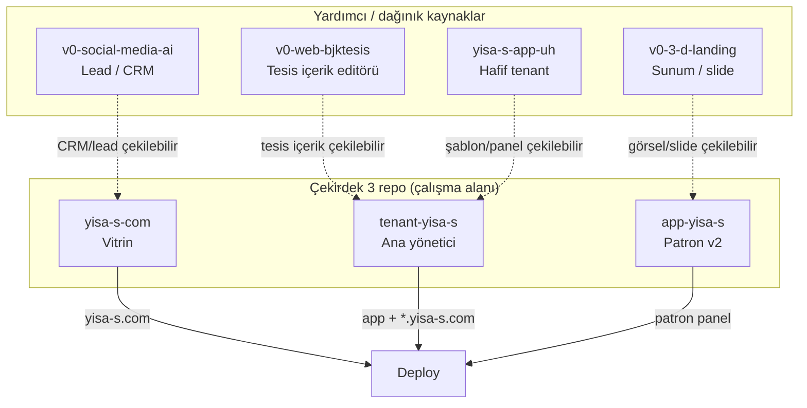

# YİSA-S — Tüm Projeler Şeması ve Mutlak Zorunluluklar

> **Tarih:** 27 Şubat 2026  
> **Kaynak:** Ziplenmiş tüm repoların tek tek taranması + mevcut YISA-S-PROJE-SEMA-VE-DURUM referansı  
> **Amaç:** Proje içinde mutlaka olması gerekenlerin ve yapılması gerekenlerin tek şema belgesi

**Görseller / çizimler:** Detaylı mimari diyagramlar (Mermaid + `docs/diagrams/` referansları) **YISA-S-PROJE-SEMA-VE-DURUM (3).md** dosyasında. Bu belgede proje ilişkisi için kısa bir diyagram aşağıda (Bölüm 4) yer alır.

**İş akışı ve aşamalar:** Baştan sona proje akışı, şu anki aşama, final iş haritası ve “bu raporun dışına çıkılmayacak” kuralı **YISA-S-IS-AKISI-VE-ASAMALAR.md** dosyasında tanımlıdır. Tüm çalışma o rapora göre ilerler.

---

## 1. Proje Envanteri (Tüm Kaynaklar)

Aşağıdaki projeler ziplenmiş veya workspace içinde mevcuttur. **Çekirdek 3 repo** ile **yardımcı / demo / türev** projeler ayrılmıştır.

### 1.1 Çekirdek Repolar (Mutlaka Olması Gereken — Ana Harita)

| # | Repo / Klasör | package.json name | Next.js | Amaç | Domain / Deploy |
|---|----------------|-------------------|---------|------|------------------|
| 1 | **app-yisa-s** | my-v0-project → öneri: app-yisa-s | 15.5.10 | Patron uygulaması (v0 futuristic dashboard): CELF, Beyin Takımı, Komut Merkezi, Gorev Panosu, Kasa, Tenant izleme | app.yisa-s.com (veya ayrı subdomain) |
| 2 | **tenant-yisa-s** | yisa-s-app | 16.1.6 | Ana yönetici: Patron Dashboard, Franchise/Veli/Antrenor panelleri, Robot sistemi, CELF merkez, subdomain yönetimi | app.yisa-s.com (Patron) + *.yisa-s.com (franchise/veli) |
| 3 | **yisa-s-com** | yisa-s-website | 14.2.0 | Vitrin sitesi: Landing, Demo formu, Franchise başvuru, NeebChat robot, CRM, Fuar hesaplama | yisa-s.com, www.yisa-s.com |

### 1.2 Yardımcı / Demo / Türev Projeler (Şemada Konumları Belli Olmalı)

| # | Repo / Klasör | package.json name | Next.js | Amaç | Zorunluluk |
|---|----------------|-------------------|---------|------|------------|
| 4 | **v0-3-d-landing-page-main** | my-v0-project | 16.0.10 | YiSA-S sunum / 3D slide landing (Hero, Features, Schedule, Panels, Branches, Credit, Directorates, AI Router, Branch Management, System Status, CTA). Python backend: patron asistanı, direktorlukler, CEO/CIO agent, AI router, Supabase | Demo / sunum; çekirdek değil. Entegre edilecekse şemada yeri net yazılmalı. |
| 5 | **v0-social-media-ai-assistant-main** | my-v0-project | 16.0.7 | Sosyal medya / lead / rezervasyon admin: login, setup, admin (catalog, messages, leads, content, deletion-requests, analytics, social, bookings, users, whatsapp, settings). AI (Vercel ai), bcryptjs | Pazarlama / CRM türevi; çekirdek değil. Kullanılacaksa ManyChat/vitrin ile ilişki şemada tanımlanmalı. |
| 6 | **v0-web-page-content-edit-bjktesis-main** | my-v0-project | 16.0.10 | BJK Tuzla Cimnastik tesis sitesi içerik düzenleme: auth (login, sign-up), dashboard. Supabase, xlsx. Vitrin + ödeme IBAN + çocuk performans panelleri | Tesis bazlı içerik editörü; tenant-yisa-s franchise siteleri veya vitrin ile ilişki şemada netleştirilmeli. |
| 7 | **yisa-s-app-uh-main** | yisa-s-app | 14.2.35 | Hafif sürüm: ana sayfa, giriş, patron, franchise, veli, antrenor, tesis panelleri. Supabase, Fal AI. CELF/Asistan dokümanları (API, kurulum, CELF merkez) | tenant-yisa-s’in basitleştirilmiş / alternatif sürümü. Çekirdek değil; “UH” rolü (demo / hızlı prototip) şemada yazılmalı. |

---

## 2. Mutlak Olması Gereken Yapı (Çekirdek 3 Repo)

Aşağıdakiler **projenin sağlıklı ilerlemesi için zorunlu** kabul edilir. Mevcut YISA-S-PROJE-SEMA-VE-DURUM dokümanı ile uyumludur.

### 2.1 Klasör / Repo Yapısı

- **app-yisa-s:** Next.js App Router, `lib/` (supabase, ai-providers, celf-*, cors, beyin-takimi, child-development, dashboard-widgets, direktorlukler, emails, middleware), `components/` (ui, dashboard), `app/` (patron, dashboard, vitrin sayfaları).
- **tenant-yisa-s:** Next.js App Router, `lib/` (supabase, subdomain, franchise-tenant, vercel, robots, patron-robot, db, auth, api, ai, security), `components/` (ui, patron, franchise-panel), `app/` (auth, patron, franchise, panel, antrenor, veli, vitrin, kasa, sozlesme vb.).
- **yisa-s-com:** Next.js App Router, `lib/` (supabase, akular, knowledge/yisas), `components/` (home, landing, layout, robot, intro, ui), `app/` (/, demo, franchise, fiyatlandirma, panel vb.).

### 2.2 Ortak Altyapı (Zorunlu)

| Bileşen | Açıklama |
|---------|----------|
| **Supabase** | Tek proje; PostgreSQL + Auth + RLS. Tüm çekirdek repolar aynı Supabase’e bağlı. |
| **Vercel** | Deploy + (tenant-yisa-s için) Cron (`/api/coo/run-due`). |
| **Environment** | Her repoda `.env.local` + `.env.example`; şemadaki Bölüm 7 (env tabloları) ile uyumlu. |

### 2.3 Domain / Subdomain (Zorunlu Netlik)

| Domain / Subdomain | Repo | Açıklama |
|--------------------|------|----------|
| yisa-s.com, www.yisa-s.com | yisa-s-com | Vitrin. |
| app.yisa-s.com | **tenant-yisa-s** (production) | Patron dashboard, franchise/veli giriş ve subdomain yönetimi tenant-yisa-s ile deploy edilir. app-yisa-s (v2 patron panel / CELF UI) ayrı subdomain veya path ile kullanılabilir; production’da tek kaynak tenant-yisa-s. |
| bjktuzlacimnastik.yisa-s.com, &lt;slug&gt;.yisa-s.com | tenant-yisa-s | Franchise tesis siteleri. |
| veli.yisa-s.com | tenant-yisa-s | Veli paneli. |

---

## 3. Mutlak Yapılması Gerekenler (Checklist)

Aşağıdakiler **yapılmadan proje “tamam” sayılmaz**.

### 3.1 Konfigürasyon ve Şema

| # | Görev | Repo / Kapsam | Durum |
|---|--------|----------------|-------|
| 1 | **Tek şema belgesi** | Tüm projeler | Bu dosya (YISA-S-TUM-PROJELER-SEMA-VE-ZORUNLULUKLAR.md) güncel tutulacak. |
| 2 | **app.yisa-s.com ataması** | Doküman | Production’da app.yisa-s.com hangi repoya (tenant-yisa-s mi, app-yisa-s mi) deploy ediliyor tek cümleyle yazılacak. |
| 3 | **package.json name** | app-yisa-s | İsteğe bağlı: `"name": "app-yisa-s"` yapılacak. |
| 4 | **.env şema uyumu** | 3 çekirdek repo | Her repoda .env.example, mevcut YISA-S-PROJE-SEMA-VE-DURUM Bölüm 7 ile karşılaştırılıp eksik değişken eklenecek. |

### 3.2 Build ve Çalıştırma

| # | Görev | Repo | Durum |
|---|--------|------|-------|
| 5 | **npm install** | app-yisa-s, tenant-yisa-s, yisa-s-com | Her birinde çalıştırılacak. |
| 6 | **npm run build** | 3 çekirdek | Build hatasız tamamlanacak. |
| 7 | **Kritik API testi** | app-yisa-s, tenant-yisa-s | En az birer CELF / patron / vitrin endpoint’i test edilecek. |

### 3.3 Yardımcı Projelerin Konumu

| # | Görev | Açıklama |
|---|--------|----------|
| 8 | **v0-3-d-landing-page** | Sunum/demo ise “demo repolar” bölümünde kalacak; çekirdek kodla birleştirilmeyecekse buna göre dokümante edilecek. |
| 9 | **v0-social-media-ai-assistant** | ManyChat / vitrin CRM ile kullanılacaksa entegrasyon noktaları şemada tanımlanacak. |
| 10 | **v0-web-page-content-edit-bjktesis** | Tenant franchise içerik editörü olarak kullanılacaksa tenant-yisa-s veya yisa-s-com ile ilişki (API / subdomain) yazılacak. |
| 11 | **yisa-s-app-uh** | “Hafif tenant” / prototip olarak konumu sabitlenecek; çekirdek tenant-yisa-s’e taşınacak özellikler varsa listelenecek. |

---

## 4. Projeler Arası İlişki (Özet)



```
Çekirdek (mutlaka):
  yisa-s-com (vitrin)     → yisa-s.com
  tenant-yisa-s (ana)     → app.yisa-s.com + *.yisa-s.com
  app-yisa-s (patron v2)  → patron CELF/Beyin Takımı/Komut Merkezi

Yardımcı (konumu net olmalı):
  v0-3-d-landing-page     → sunum / 3D slide demo (Python + Next)
  v0-social-media-ai      → sosyal medya / lead admin + AI
  v0-web-page-bjktesis    → BJK tesis içerik editörü (Supabase)
  yisa-s-app-uh           → hafif tenant (patron/franchise/veli/antrenor/tesis)
```

---

## 5. Teknik Özet Tablosu (Tüm Projeler)

| Proje | Next | React | Supabase | Özel Bağımlılıklar |
|-------|------|-------|----------|---------------------|
| app-yisa-s | 15.5.10 | 19 | ✓ | ai, @vercel/blob, swr, dnd-kit, recharts |
| tenant-yisa-s | 16.1.6 | 18 | ✓ | anthropic, google, openai, octokit, pg |
| yisa-s-com | 14.2.0 | 18 | ✓ | anthropic, framer-motion |
| v0-3-d-landing-page | 16.0.10 | 19 | (Python tarafı) | framer-motion, recharts, Python backend |
| v0-social-media-ai | 16.0.7 | 19 | - | ai, bcryptjs |
| v0-web-page-bjktesis | 16.0.10 | 19 | ✓ | xlsx |
| yisa-s-app-uh | 14.2.35 | 18 | ✓ | @fal-ai/serverless-client |

---

## 6. Dağınık Çalışmaların Birleştirilmesi (Şablonlar / İçerikler)

Dağınık kalan hazırlıkların **çekirdek 3 klasöre çekilmesi** gerekir; böylece tek yerde çalışılır. Aşağıda hangi kaynaktan neyin nereye taşınacağı planı yer alır.

### 6.1 Nereden → Nereye (Çekilecekler)

| Kaynak (yardımcı proje) | Hedef (çekirdek) | Çekilebilecekler |
|------------------------|------------------|-------------------|
| **v0-3-d-landing-page** | app-yisa-s veya yisa-s-com | Sunum slideları (Hero, Features, Schedule, Panels, Branches, Directorates, AI Router, System Status, CTA); görsel şablonlar. Python backend ayrı kalabilir veya sadece referans. |
| **v0-social-media-ai-assistant** | yisa-s-com (vitrin/panel) veya tenant-yisa-s | Admin sayfaları (leads, messages, catalog, analytics, whatsapp); CRM/lead bileşenleri. ManyChat entegrasyonu ile ilişkilendirilebilir. |
| **v0-web-page-content-edit-bjktesis** | tenant-yisa-s | Tesis vitrin sayfası, ödeme/IBAN paneli, çocuk performans paneli; auth/dashboard yapısı. Franchise tesis sitelerine “içerik düzenleme” olarak entegre edilebilir. |
| **yisa-s-app-uh** | tenant-yisa-s | Patron/franchise/veli/antrenor/tesis sayfa şablonları; CELF/Asistan dokümanları (referans veya lib’e taşınacak metinler); basit Supabase şemaları. |

### 6.2 Birleştirme Sırası (Öneri)

1. **Önce:** Çekirdek 3’te build + env tamam olsun (npm install, .env şema uyumu).
2. **Sonra:** Hedefi tek tek seç (örn. önce bjktesis’ten tenant-yisa-s’e tesis içerik panelleri).
3. **Kopyala/taşı:** Sadece gerekli bileşen ve sayfaları hedef repoya kopyala; import path’leri ve env’i hedefe göre düzelt.
4. **Test:** Hedef repoda `npm run build` ve manuel kontrol.
5. **Şemayı güncelle:** Bu bölümde “çekildi” işaretle, yardımcı projede “taşındı” notu bırak.

### 6.3 Şu An Ne Yapıyoruz / Sıradaki Adım

| Şu an | Açıklama |
|-------|----------|
| **Durum** | Tüm projeler haritalandı; çalışma alanı = app-yisa-s, tenant-yisa-s, yisa-s-com. Zorunluluk listesi ve birleştirme planı bu belgede. |
| **Görseller** | Detaylı çizimler ana şemada (YISA-S-PROJE-SEMA-VE-DURUM). Bu belgede Bölüm 4’te proje ilişki diyagramı eklendi. |
| **Sıradaki** | 1) Çekirdek 3’te npm install + build + .env kontrolü. 2) Birleştirme planından bir kaynak seçip (örn. bjktesis veya yisa-s-app-uh) ilk “çekme” işini yapmak. 3) Her çekmeden sonra bu şemayı güncellemek. |

---

## 7. Referans

- **Ana şema (detay + görseller):** YISA-S-PROJE-SEMA-VE-DURUM (3).md — mimari diyagramlar, tablolar, API, env, CELF roadmap.
- **Eksikler listesi:** tenant-yisa-s içindeki YISA-S-EKSIKLER-VE-YAPILACAKLAR.md.
- **Bu belge:** Tüm projelerin envanteri + mutlak zorunluluklar + yardımcı projelerin konumu + **dağınık çalışmaların çekirdek 3’e nasıl çekileceği**.

Bu şemaya göre ilerlenmeli; değişiklikler önce bu belgede ve (detay için) YISA-S-PROJE-SEMA-VE-DURUM’da güncellenmelidir.
